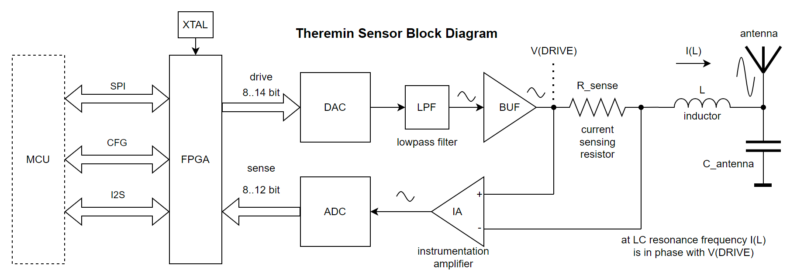

Design of FPGA based current sensing theremin sensor with MCU and FPGA compatible interface
===========================================================================================

* Drive signal is pure sine wave generated with FPGA + DAC [numerically controlled oscillator](https://en.wikipedia.org/wiki/Numerically_controlled_oscillator).
* Sallen-key filter to convert quantized DAC output into pure sine
* Filtered and buffered pure sine drive signal is fed to inductor of theremin LC tank (L = inductor, C = antenna).	
* Current sensing for drive current - measure voltage on sensing resistor between drive buffer and inductor.
* Sensed value of drive current is read by FPGA using ADC.
* FPGA internal logic can implement extremely sensitive and low latency phase error calculation - on LC tank resonant frequency drive current should have zero phase shift with drive voltage.
* FPGA implements Digital Phase Locked Loop (DPLL) - as in D-Lev theremin by Eric Wallin
* Flexible external interface of sensor module - pins assignment and behavior can be redefined in FPGA logic.
* Trying to minimize sensor module cost while getting maximum sensitivity

Theory of operation
===================

Theremin is musical instrument controlled by distance of hands from two "antennas".

* Distance of hand to Pitch antenna controls note frequency.
* Distance of hand to Volume antenna controls note volume.

Sensor for digital theremin should provide distance from hand to antenna with high resolution and low latency.

Minimal playable latency is 10ms (100Mhz). Nice to have - 1ms (1KHz). Ideal - one audio sample, e.g. 48KHz.

Playable distance (for pitch antenna) - maximal distance where individual notes are recognizable with good enough resolution (e.g. cents).

Good enough theremin has playable distance 50-60 cm. Ideal - up to 60-80cm.

Distance from hand to antenna can be sensed by measuring of antenna capacitance to "virtual ground".

Antenna itself depending on type (rod or plate) and size has capacitance about 8-12pF (C_ant).

When hand is very close to antenna, antenna C is increased by about 2 pF (C = C_ant + C_hand). 

When hand moves away from antenna, each 10cm of distance reduce C_hand by 3.5 .. 4 times. At 10cm C_hand is 0.5pF, at 20cm it decreases to 0.125pF, and so on. At 60cm C_hand is about 0.0005pF.
To be playable at some distance, 1000 times smaller C_hand difference should be visible by sensor, e.g. 0.0005pF/1000 = 0.0000005pF

To measure C=(C_ant+C_hand) let's use LC oscillator and measure its frequency, which is proportional to 1/sqrt(L*C)

Stable LC oscillator may be implemented using phase locked loop (PLL). 

Driving LC tank with clean sine wave shaped voltage, and measuring of LC tank drive current can reduce noise sensed by antenna.

At resonance, LC tank drive voltage and current have zero offset.

Let's use FPGA as a part of LC oscillator. Drive waveform will be generated by NCO (numerically controlled oscillator) and converted to clean sine voltage using DAC and lowpass filter.

Drive current can be sensed by measuring of voltage drop on small value R_sense resistor connected between drive buffer and LC tank.

Sensed current can be read by FPGA using ADC, and then used to calculate phase offset between drive voltage and drive current.

Sensed phase shift allows to calculate real LC resonance frequency, knowing current drive frequency, phase shift and LC tank parameters (mainly, Q). Relation between drive signal frequency difference from LC resonance can be measured during calibration phase, to prepare phase shift to frequency correction table.

Sensor should correct drive (NCO) frequency to keep it as much as possible close to LC resonance frequency - by keeping phase offset close to zero. It forms PLL - phase locked loop, actually - digital PLL because frequency correction is implemented in digital form inside FPGA.

How to calculate phase offset between two signals of the same frequency, if one of them can have unknown amplitude? If two sine of the same frequency F with some phase shift PHI between them are being multiplied - product will look like sine of doubled frequency with additional DC offset corresponding to phase shift sin(2*F)+DC.

Lowpass filter can be used to filter out sin(2*F) component keeping only DC offset part.

To calculate phase offset, we can get two base signals with 90 degrees shift between them (SIN and COS from NCO), multiply both of them to input ADC value, LP filter to keep only DC parts, and then use atan2(SIN_MUL_ADC_DC, COS_MUL_ADC_DC) to calculate phase shift.

Sensor simulator
================

I've created an application to simulate sensor and evaluate its precision for different parameters.

It's Qt application, source code is available [here](https://github.com/fpga-theremin/sensors/tree/main/fpga_sensor/simulator/sensor_simulator)

Choosing FPGA device
====================

FPGA device should be cheap but powerful enough to implement all the features of sensor, available in stock.

Current candidates (Lattice iCE40 Ultra family, QFN-48 package, 39 I/O):

| Device   |  Description | Mouser link | Mouser stock | Mouser price | JLCPCB link | JLCPCB price |
| ------   |  ----------- | ----------- | ------------ | ------------ | ----------- | ------------ |
| ICE5LP4K-SG48ITR | 3520LE, 20EBR, 4DSP | [842-ICE5LP4K-SG48ITR](https://eu.mouser.com/ProductDetail/Lattice/ICE5LP4K-SG48ITR?qs=ZwKJWZfDtNj9QagUtdRf4g%3D%3D) | 34K | EUR 7.69 | [C2651898](https://jlcpcb.com/partdetail/Lattice-ICE5LP4KSG48ITR/C2651898) | $11.63 |
| ICE5LP2K-SG48ITR | 2048LE, 20EBR, 4DSP | [842-ICE5LP2K-SG48ITR](https://eu.mouser.com/ProductDetail/Lattice/ICE5LP2K-SG48ITR?qs=ZwKJWZfDtNgAWzMHJRGDug%3D%3D) | 3K | EUR 6.60 | not available | - |
| ICE5LP1K-SG48ITR | 1100LE, 16EBR, 2DSP | [842-ICE5LP1K-SG48ITR](https://eu.mouser.com/ProductDetail/Lattice/ICE5LP1K-SG48ITR?qs=ZwKJWZfDtNg6punXjA%252B0Og%3D%3D) | 1.5K | EUR 5.22 | [C1550810](https://jlcpcb.com/partdetail/Lattice-ICE5LP1KSG48ITR/C1550810)  | $9.37 |

Resources in table above:

* **LE** - logic element (LUT4 + FF)
* **EBR** - memory block (single port 256x16)
* **DSP** - 16x16 mul + 32 bit accumulator

**ICE5LP1K-SG48ITR** is smaller device (probably design will not fit).

SPI interface
=============

SPI slave interface in FPGA will be used for:

* updateing of FPGA configuration (once on powerup to program configuration SRAM or once by Diamond programmer - to upload configuration into non-volatile memory)
* controlling the sensor (after configuration is done) - by reading and writing of sensor registers and parameter tables.

SPI slave signals:

| Signal name  | Direction | Description |
| -----------  | --------- | ----------- |
| **SPI_CLK**  | input     | SPI clock input (SCLK) |
| **SPI_SS**   | input     | slave select, active 0 (CS) |
| **SPI_SI**   | input     | SPI slave data input (MOSI) |
| **SPI_SO**   | output    | SPI slave data output (MISO) |

Configuration signals - to be used for programming.

| Signal name  | Direction | Description |
| -----------  | --------- | ----------- |
| **CRESET_B** | input     | configuration reset, 0 to start configuration |
| **CDONE**    | ouput     | configuration done |

FPGA configuration modes
========================

* Configure from NVCM (non-volatile configuration memory) - programming can be done once when needed, then configuration will be performed from NVCM on powerup
* Configure using slave SPI interface from external MCU - firmware should be uploaded each time on powerup

NVCM Programming
================

* option 1: use Diamond Programmer and the Lattice programming cable
* option 2: use EmbeddedProgramming - no information available, datasheet sais "The NVCM can be programmed using a processor. For more information, contact your local Lattice sales office."

Sensor SPI interface registers
==============================

| Address | Name   | Size  | Description                             |
| ------- | ----   | ----  | --------------------------------------- |
| 0       | Status | 8 bit | TODO                                    |

Some notes about required registers.

Flags:

    SENSOR_ENABLE   1bit  R/W  0: oscillator stopped, 1: oscillator is working
    FREQ_LOCK       1bit  R/W  1: use PHASE_INCREMENT_OVERRIDE for DCO, 0: use PLL

Long registers:

    MIN_PHASE_INCREMENT      32bit R/W  calibration setting, min limit for DPLL working range
    MAX_PHASE_INCREMENT      32bit R/W  calibration setting, max limit for DPLL working range
    ZERO_PHASE_OFFSET        24bit R/W  calibration setting, phase offset value for resonance
    PHASE_INCREMENT          32bit R/O  read: current phase increment
    PHASE_INCREMENT_OVERRIDE 32bit R/W  to allow fixing oscillation frequency
    PHASE_OFFSET             24bit R/W  current phase offset corrected by ZERO_PHASE_OFFSET

Sensor stream interface
=======================

Sensor may output measured values one per audio sample using I2S interface.

Depending on sensor firmware, sensor may send various types of data. Reasonable mode:

* pitch sensor: phase
* volume sensor: gain multiplier

Primitive synthesizer might just get wave table entry using phase as table index, and multiply to gain value to produce a new audio sample.

Sensor I2S Pins: 

| Signal name  | Direction | Description |
| -----------  | --------- | ----------- |
| **I2S_BCLK** | input     | bit clock   |
| **I2S_LRCK** | input     | left/right channel |
| **I2S_DO**   | output    | I2S data output from sensor (16/24/32 bits) - left channel value contains measurement from this sensor, right channel value may replicate left channel value from I2S_DI |
| **I2S_DI**   | input     | I2S data input to sensor - may be used to merge streams from second sensor (left channel) and replicate as right channel in I2S_DO, connect to GND if there is no previous sensor in chain. |

Chaining two sensors using I2S_DO and I2S_DI allows to use only single I2S stereo channel (DIN) of MCU to receive data streams from both pitch and volume sensors.

See I2S docs for details.

Streaming of sensor values as I2S data is a feasible transport - MCU may receive it as additional audio stream using DMA, and get nice per-sample interpolated values.

Components selection
====================

Trying to find suitable components with optimal performance/price.
JLCPCB assembly service is planned to be used, so JLCPCB stock and price is important while this selection.

* **DAC**

| Device         | Package  | Bits | MHz | Mouser price | Mouser stock | JLCPCB price | JLCPCB stock |
| -------------- | -------  | ---- | --- | ------------ | ------------ | ------------ | ------------ |
| AD9748ACPZ     | LFCSP-32 | 8    | 210 | EUR 10.74    | 926          | $7.67        | 41           |
| AD9704BCPZ     | LFCSP-32 | 8    | 175 | EUR  9.52    | 4728         | $7.94        | 73           |
| AD9707BCPZ     | LFCSP-32 | 14   | 175 | EUR 19.21    | 734          | $10.23       | 64           |
| AD9744ACPZRL7  | LFCSP-32 | 14   | 210 | EUR 21.74    | 2759         | $3.9         | 10           |
| AD9744ARUZRL7  | TSSOP-28 | 14   | 210 | EUR 24.31    | 326          | $6.03        | 115          |

For DAC, it makes sense to choose LFCSP-32 package and design the board to support different compatible DACs.

While AD9744ACPZRL7 is available for extremely cheap price on JLCPCB, use it. If not available, switch to other device like AD9704BCPZ.

* **ADC**

| Device           | Package  | Bits | MHz | Mouser price | Mouser stock | JLCPCB price | JLCPCB stock |
| --------------   | -------  | ---- | --- | ------------ | ------------ | ------------ | ------------ |
| AD9283BRSZ-100   | SSOP-20  | 8    | 100 | EUR 15.74    |          645 | $3.9         | 42           |
| AD9215BRUZ-105   | TSSOP-28 | 10   | 105 | EUR 19.65    |         1695 | $14.08       | 65           |
| AD9215BCPZ-105   | LFCSP-32 | 10   | 105 | EUR 19.14    |         1035 | $17.76       | 1            |
| AD9215BCPZ-65    | LFCSP-32 | 10   |  65 | EUR 14.22    |           53 |              |              |
| AD9235BRUZRL7-40 | TSSOP-28 | 12   |  40 | EUR 20.60    |           32 | $6.19        | 88           |
| AD9235BCPZRL7-40 | LFCSP-32 | 12   |  40 | EUR 20.66    |          972 | $7.37        | 183          |

For 100MHz ADC, 8-bit SSOP-20 AD9283BRSZ-100 is probably the best choice - if available on JLCPCB.

If 40MHz is ok, cheap 12-bit ADCs are available on JLCPCB.

For low sample rate ADC, DAC may work on higher frequency, e.g. x2 or x4 (80MHz or 160MHz for 40MHz ADC) to produce cleaner sine wave.

Current choice:

| Component | Device           | Description              | Mouser price | Mouser stock | JLCPCB price | JLCPCB stock |
| --------- | --------------   | ------------------------ | ------------ | ------------ | ------------ | ------------ |
| DAC       | AD9744ACPZRL7    | LFCSP-32, 14bit, 210 MHz | EUR 21.74    | 2759         | $3.9         | 10           |
| ADC       | AD9235BCPZRL7-40 | LFCSP-32, 12bit, 40MHz   | EUR 20.66    |  972         | $7.37        | 183          |

