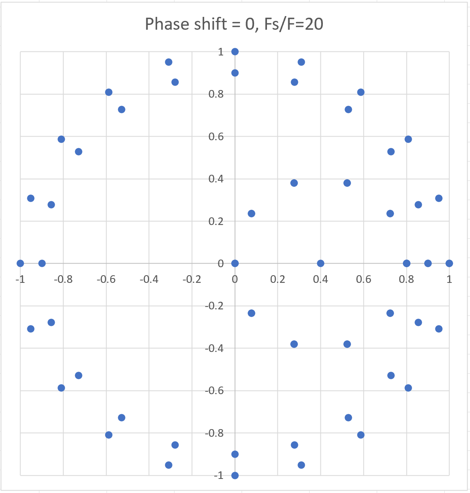
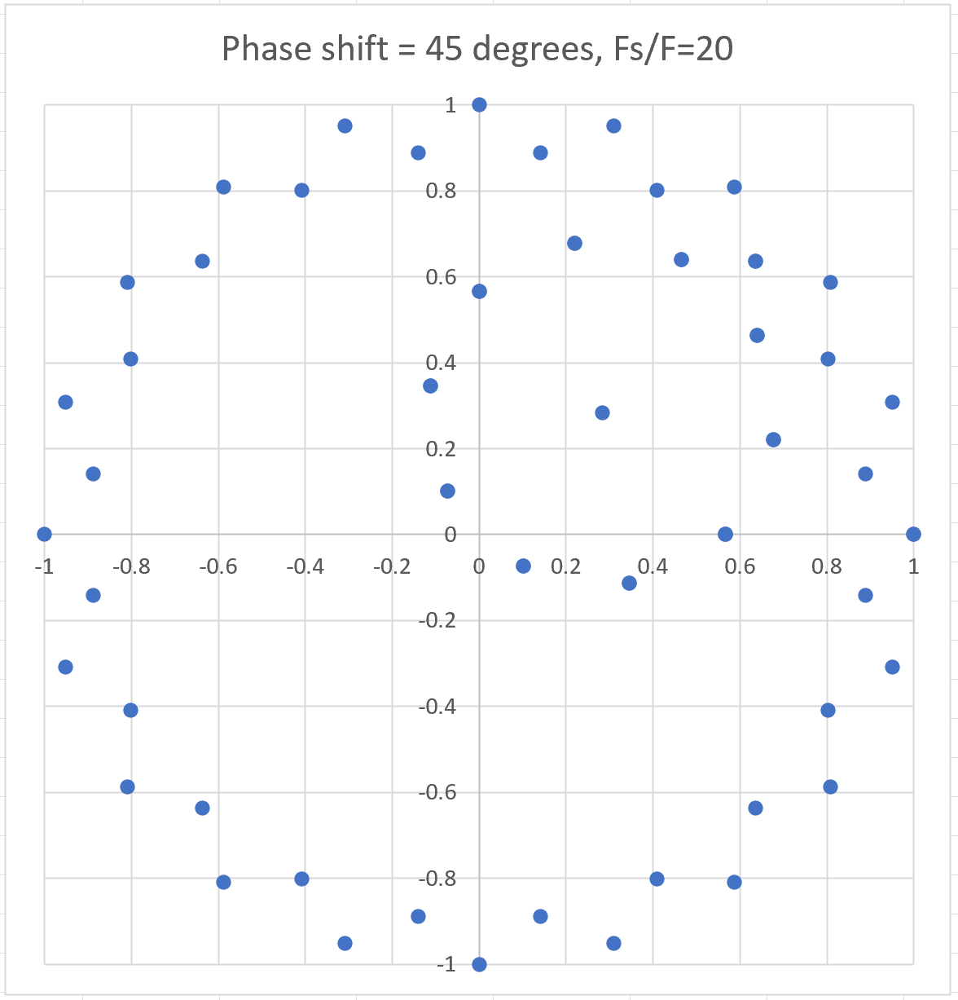
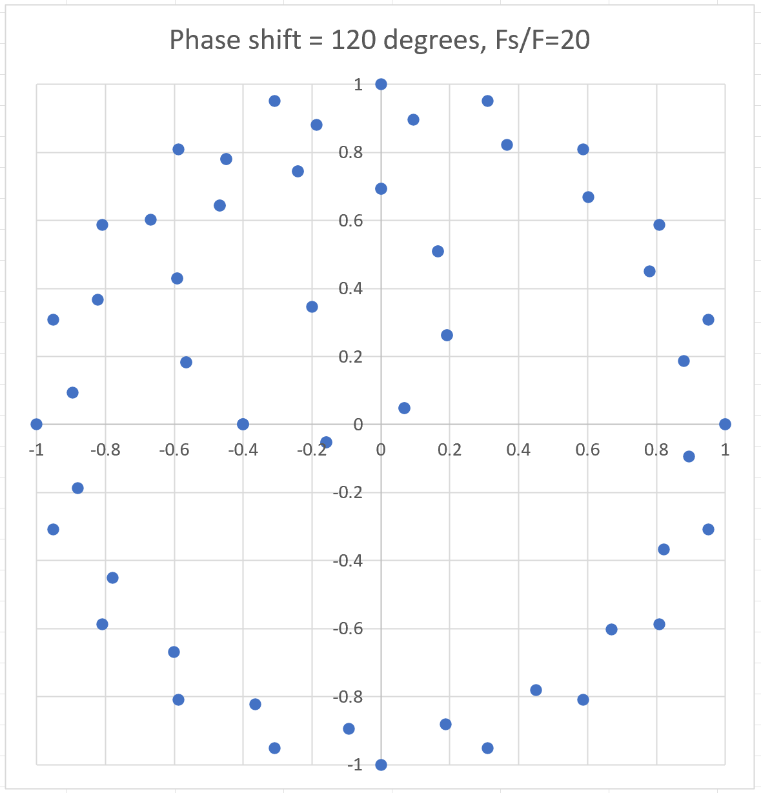
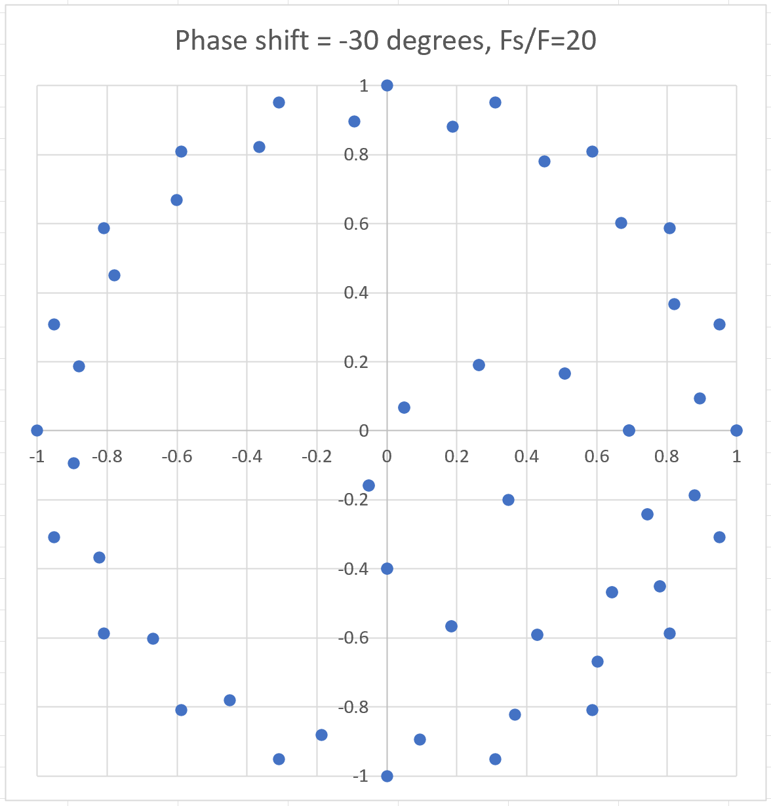
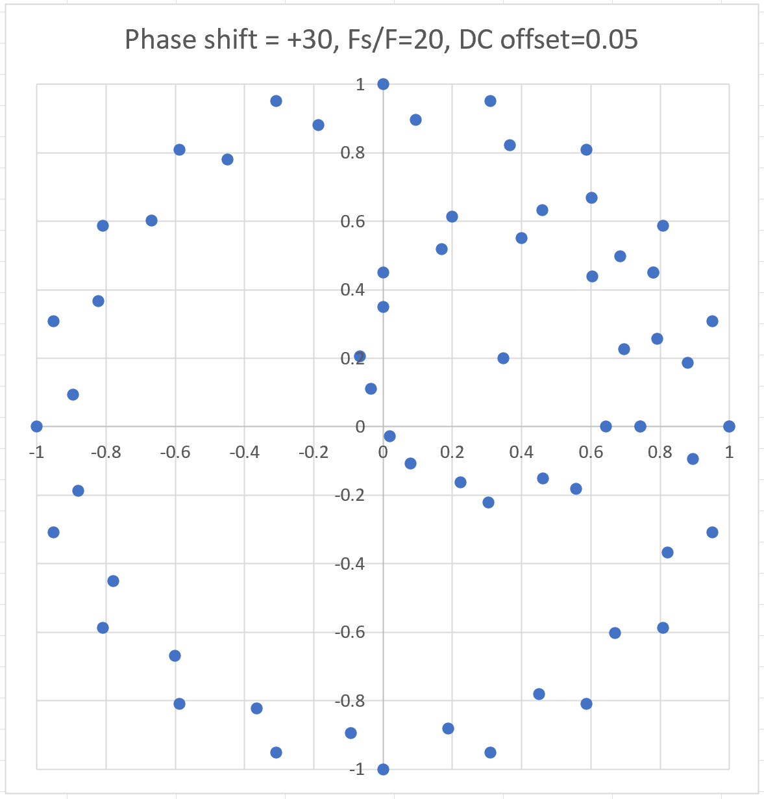
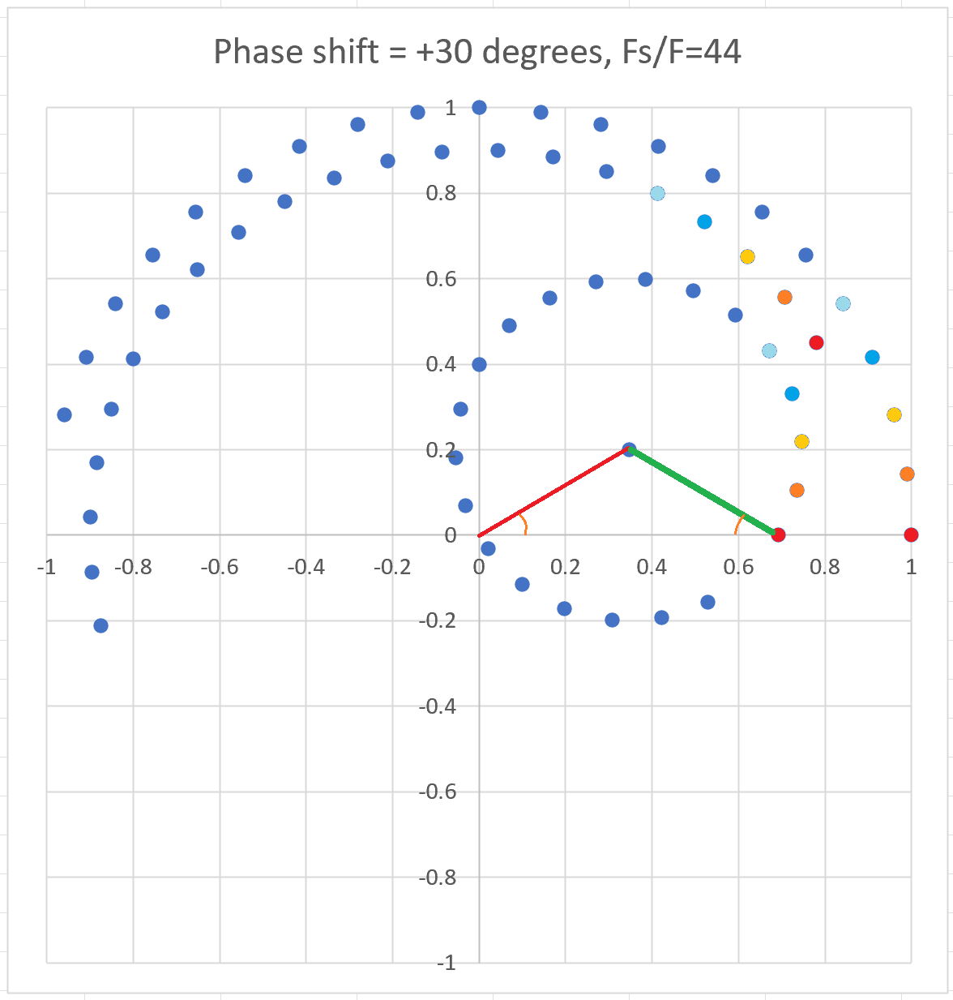

Some research notes on Theremin Sensor design
=============================================

Phase shift detection
---------------------

NCO (Numerically Controlled Oscillator) inside FPGA generates sine wave DRIVE signal to drive LC tank (converted from digital form to analog by DAC). 

Current flowing through LC tank is being measured by measurement of voltage dropped on R_sense resistor. 
LC current SENSE signal is being converted to digital form by ADC, and going back to FPGA for processing.

When DRIVE signal frequency is matching resonance frequency of LC tank, DRIVE and SENSE signals are in phase (have zero phase shift).
Due to change antenna capacitance C, resonance frequency of LC tank changes by sqrt(C).
When frequency of DRIVE is a bit bigger or lower than LC resonance frequency, phase of SENSE signal gets some offset - coming slightly before or after DRIVE.
When difference of DRIVE frequency from resonance getting bigger, phase shift increases.

When sensor see non-zero phase shift, it should correct DRIVE frequency to return phase shift back to zero - keeping DRIVE frequency as close to LC resonance as possible. 
This behavior is called Phase Locked Loop (in our case - Digital Phase Locked Loop - DPLL).

So, we need to find some method to calculate phase shift between known NCO phase and SENSE signal value from ADC.

To find phase difference between two sine signals of the same frequency we may multiply two sines of frequency f and get sine of doubled frequency 2 * f and constant (DC, zero frequency) component corresponding to sin(shift).

    sin(phase*f) * k * sin(phase*f + shift) = sin(phase * 2 * f) + k * sin(shift)

DC value sin(shift) is scaled by unknown value - amplitude of current sensed by ADC. So, one having k * sin(shift) is not enough to calculate exact phase shift value.

If we multiply signal of unknown phase by two sines shifted by 90 degrees, DC components of two products will give sin(shift) and cos(shift) which can easy be transformed to phsae shift angle by using of atan2(dc_sin,dc_cos).
As well, atan2() is not sensitive to scaling of ADC value, so having different amplitude of sensed signal is not more a stopper for precision phase shift measurement.

    sin(phase*f) * k * sin(phase*f + shift) = sin(phase*2*f) + k * sin(shift)
    cos(phase*f) * k * sin(phase*f + shift) = sin(phase*2*f) + k * cos(shift)

We need some method to filter out double frequency component from results of multiplication and leave only DC part - sin(shift) and cos(shift).

Simple method is to use some lowpass filter. But it adds latency. Let's try to find some way for getting precise phase offset during time shorter than one signal period.

Let's try to simulate quadrature phase detector in spreadsheet.
Put formulas for producing samples for NCO_SIN and NCO_COS signals of amplitude 1.0, and simulated ADC signal (which is the same as NCO COS, but with reduced amplitude 0.8 and shifted by phase offset 

    ADC=NCO_COS(phase-offset)) * 0.8

Then we can multiply NCO SIN and NCO COS by ADC signal - to get SIN_MUL_ADC and COS_MUL_ADC.
Formulas use parameters like phase shift, ADC amplitude, ADC DC offset and Sample Rate to Signal Frequency Rate.

Let's create chart using 21 points with X = cos, Y = sin.
Additionally let's show ADC with a bit different amplitude (0.9 instead of real 0.8) - for visibility.

Phase offset is 0 (ADC signal equals to NCO COS, but with amplitude 0.8).

* Outer circle of radius 1.0 is NCO signal. 
* Smaller circle of radius 0.9 is ADC.
* Small circle of radius 0.4 is ADC multiplied by NCO SIN and COS

Phase offset is 45 degrees.

Phase offset is 120 degrees.

Phase offset is -30 degrees.

As we can see, angle between direction from (0,0) to small circle center and X axis equals to phase shift.

Small circle always passes through point (0,0)

If we know circle center coordinates (x,y), we can easy calculate phase shift using atan2:

    phase_shift_angle = atan2(x, y)

Center position of small circle may be obtained by averaging of coordinates of points on circle - LP filtering of them.

Interesting: if there is a DC offset in ADC signal, small circle turns into 2 circles - one smaller, and one bigger. 
Bus still direction to center of both of them corresponds to phase shift.

Why there are only 10 points on small circle, while 20 points on big circle?

Let's increase F_sample/F rate to let points populate less than half of full period.

Now we can see that points on small circle rotate twice faster than on big circle - frequency of NCO * ADC product is 2 times higher than frequency of NCO.

