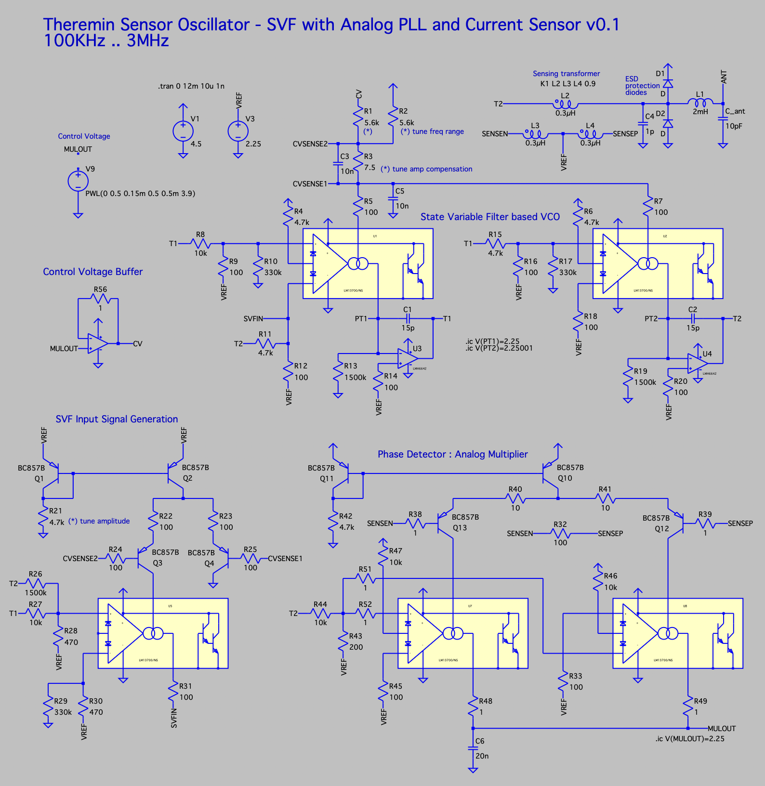
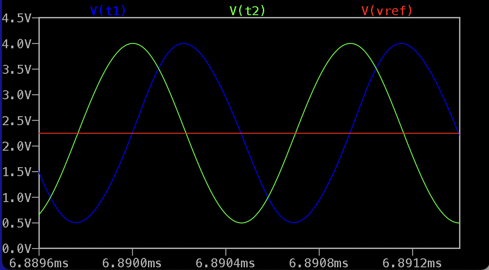
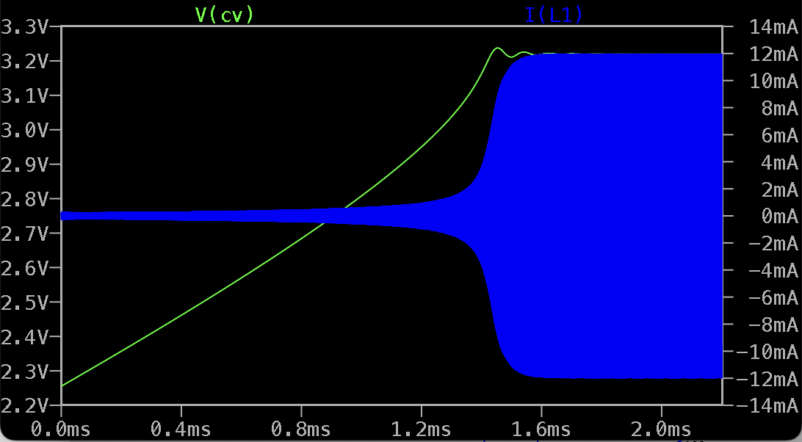
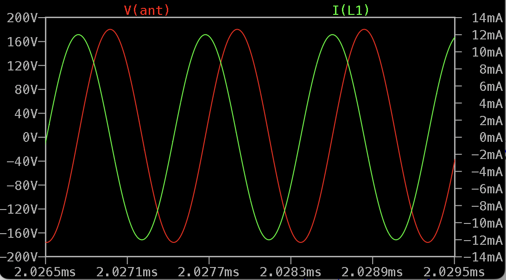
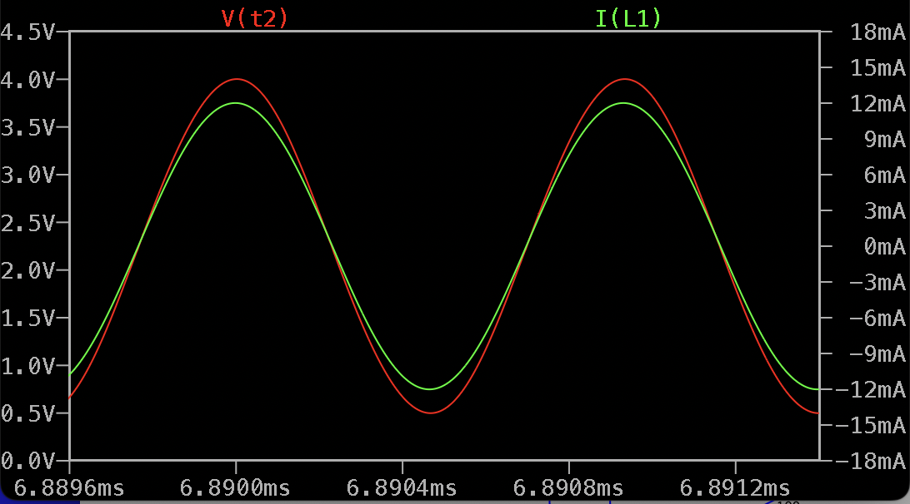

Current Sensing Analog PLL Oscillator With Full Quadrant Pure Sine Output
=========================================================================

Stability and cost optimized schematic.

It's supposed to be practically usable.

- VCO is based on State Variable Filter with pure SINE wave full quadrant output (SIN+COS)

- VCO provides stable amplitudes and alignment in wide frequency range 100KHz .. 3MHz

- PLL working frequency range is adjustable using 2 resistors

- PCB transformer as a current sensor

- Analog multiplier as a precise phase detector

- Drive signal amplitude is adjustable in wide range, 1.5 - 4Vpp

- Wide range of supported parameters for Inductor and Antenna

LTSpice model: [analog_pll_svf_osc_v01.asc](analog_pll_svf_osc_v01.asc)

The schematic is expected to be cheap, with PCB manufacturing and assembly using JLCPCB.

* 3 x LM13700 - dual OTA - TI, SOIC-16 : $0.78 * 3 = $2.34
* 1 x LMH6642 - dual OpAmp - TI, SOIC-8 : $1.27
* 4 x BCM857BS,115 PNP mathing pair : $0.28 * 3 = $0.84 
* 1 x MCP6022 - dual OpAmp - Microchip, SOIC-8 : $1.02

Total cost for main components: 2.34 + 1.27 + 0.84 + 1.02 = $5.47

* second half of MCP6022 can be used as VREF buffer
* second half of one of LM13700 is free and may be used for interface part

Simulation results
------------------

VCO outputs : full quadrant 3.5Vpp sine waves with -50dB 2nd and 3rd harmonic level

PLL Locking process: Control Voltage and antenna voltage

Antenna voltage and inductor current when PLL is locked

Drive signal voltage and inductor current are perfectly aligned when PLL is locked

Interfacing with MCU or FPGA
============================

Simple square signal frequency measure
--------------------------------------

Sin or Cos output of VCO may be converted to 3.3V square and fed to MCU or FPGA.

Frequency measurement algorithm may look like

* Increment timer counter every cycle
* If input signal transition is detected, capture current timer counter value and pass for further processing
* Subtract captured timer value from another one delayed by N oscillator periods to get value of N signal periods counted in timer clock cycles, to achieve log2(N) additional precise bits with only N/2 latency.
* Average values from previous step using CIC filter
* Calculate oscillator frequency (period) from CIC filter output
* Convert oscillator frequnecy to theremin axis value based on sensor calibration parameters

RPI Pico chip RP2350 may be used instead of FPGA - two PIO state machines working together are able to sample edge positions with sys_clk precision, and put timer value to ring buffer via DMA.

CPU may do the rest of the work for averaging, oscillator frequency to sensor value conversion, and implement interface for sensor configuration (e.g. via SPI) and streaming of axis values to the main digital theremin module (e.g. for each audio sample, using I2S).

RP2350 can be overclocked to 400MHz sys_clk or higher, to achieve FPGA-level of edge detection precision.

* RP2354B QFN-80-EP(10x10) costs $1.6 on JLCPCB

The ways to improve frequency measurement precision:

* Combine Sin and Cos outputs using XOR to double have 4 edges per oscillator period istead of 2 (capture zero crossing positions for both SIN and COS) - this is almost for free.
* Generate two additional phases: -45 degrees and +45 degrees from SIN and COS, convert to square, combine with XOR, and then XOR with 0 and 90 digrees XOR output - to get 8 edges per oscillator period.

SDR-like full quadrant output to phase value conversion using 2xADC + ATAN2
---------------------------------------------------------------------------

* Sample both SIN and COS simultaneously using ADC at high enough rate
* Convert SIN and COS to phase using ATAN2 lookup table
* Append autoincrementing cycle counter when calculated phase wraps from 360 degrees to 0 degrees
* Subtract phase of current sample from one delayed by N ADC cycles to get average value with latency of N/2 ADC cycles, without noise.
* Average value from previous step using simple CIC filter
* Calculate oscillator frequency (period) from CIC filter output
* Convert oscillator frequnecy to theremin axis value based on sensor calibration parameters

Recommended cost-optimized hardware: 

* HT9201ARSZ - dual-channel multiplexing 10bit 20MHz ADC SSOP-28 (pin compatible to AD9201) - $3.22 on JLCPCB
* RP2354B QFN-80-EP(10x10) costs $1.6 on JLCPCB

Single PIO of RP2350 may capture both SIN and COS values from ADC and send to MCU ring buffer using DMA.

One of RP2350 cores can get SIN and COS values from DMA buffer, convert them using ATAN2 lookup table, and do averaging to provide new measurement e.g. once per audio sample.

RP2350 can be overclocked to 400MHz sys_clk or higher, to achieve FPGA-like level of edge frequency measure performance.

