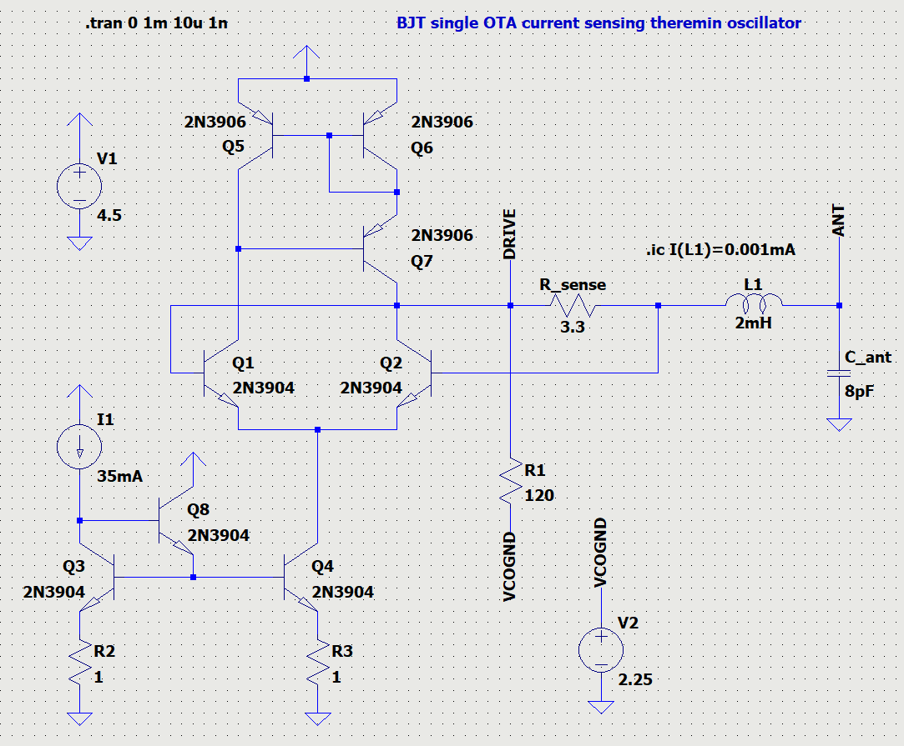
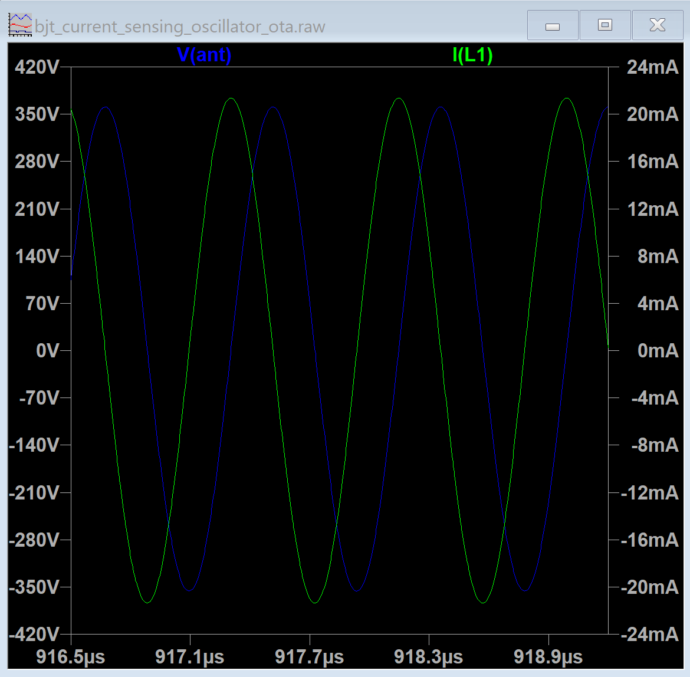
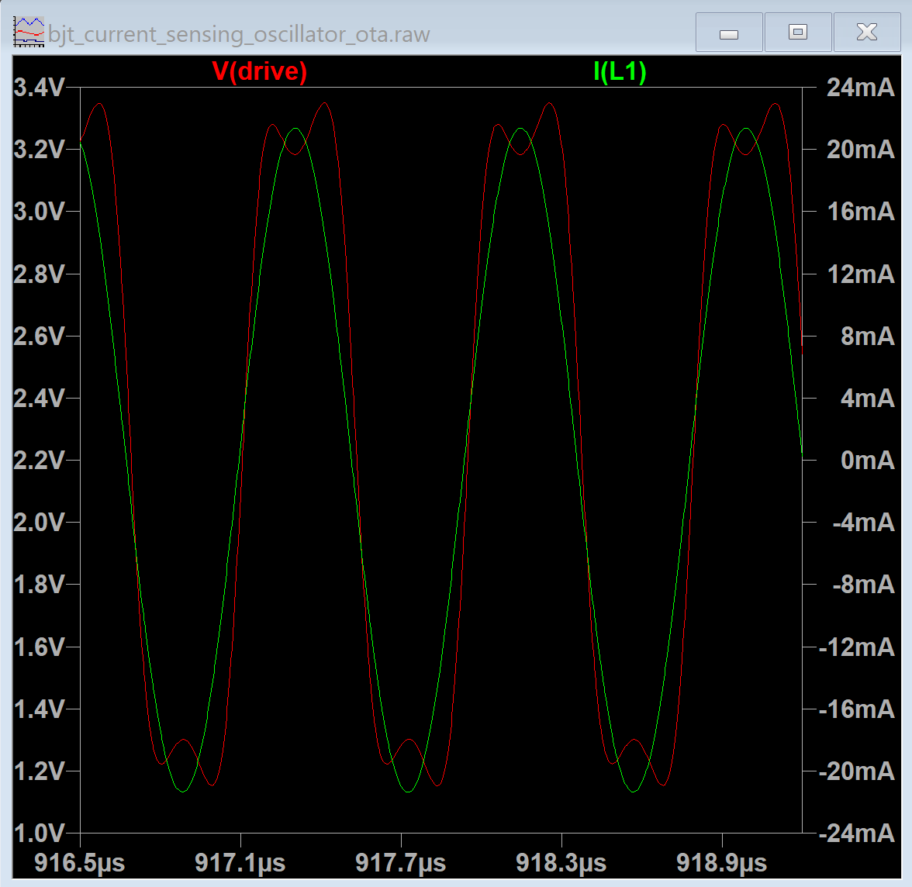
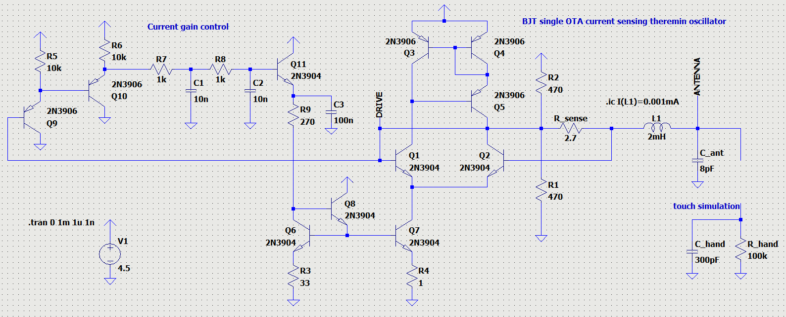
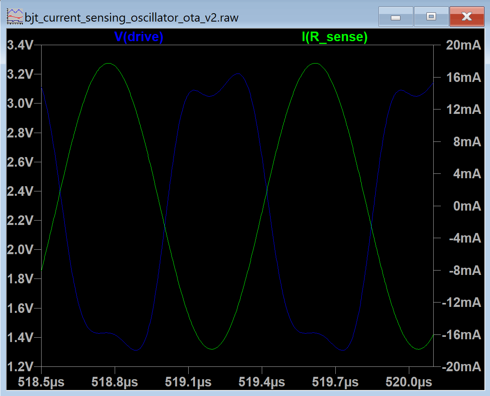
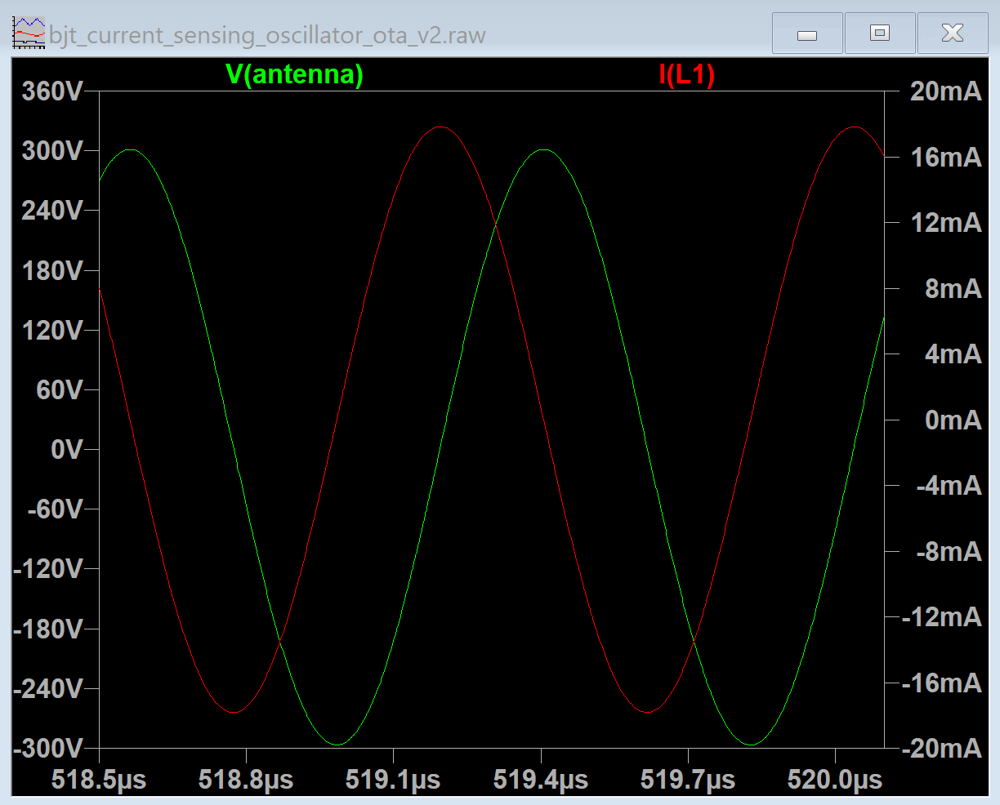
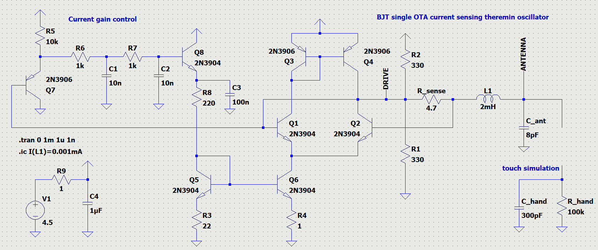
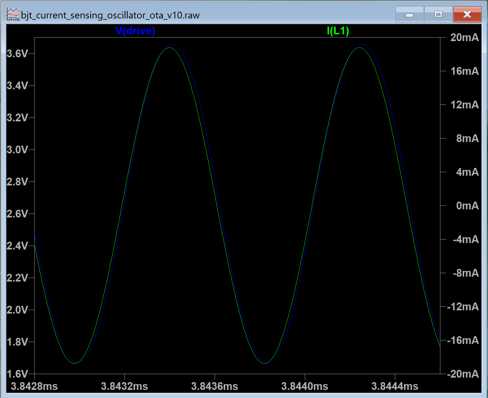
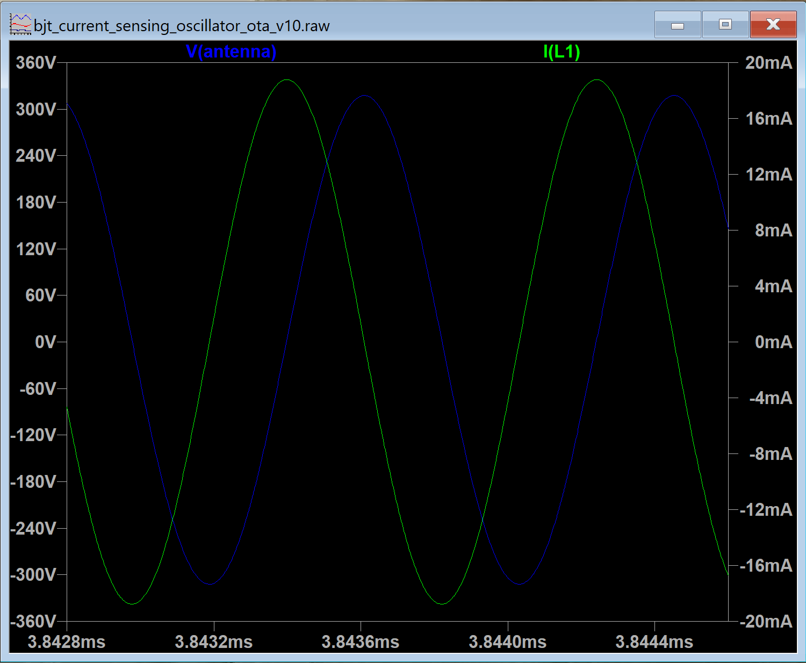

Current sensing oscillator on single OTA.
=========================================

This directory contains a collection of current sensing oscillators intended for using in Theremin.

Simple single OTA current sensing oscillator
--------------------------------------------

LC tank current is being sensed as voltage on R_sense used to drive LC tank.

OTA amplifies R_sense voltage and provides its current output to drive LC tank.

R_sense value, OTA load resistor R1, and OTA current control I1 values should be tuned for particular inductor parameters.

LTSpice model: [bjt_current_sensing_oscillator_ota.asc](bjt_current_sensing_oscillator_ota.asc)

Simulation results: drive signal and LC tank current

Simulation results: LC tank current and antenn voltage swing

Single OTA current sensing oscillator with automatic gain control
-----------------------------------------------------------------

Adding automatic gain control to previous model.

Now it can support wide range of inductor values, and even keep oscillation after touching of antenna.

In this model, I'm using 2mH inductor with 20 Ohm serial resistance.

LTSpice model: [bjt_current_sensing_oscillator_ota_v2.asc](bjt_current_sensing_oscillator_ota_v2.asc)

Simulation results: drive signal and LC tank current

Simulation results: LC tank current and antenn voltage swing

Current sensing oscillator with automatic gain control - simple current mirrors
-------------------------------------------------------------------------------

Simplified version of previous model.
Only 8 BJTs.

LTSpice model: [bjt_current_sensing_oscillator_ota_v10.asc](bjt_current_sensing_oscillator_ota_v4.asc)

Current sensing oscillator with automatic gain control - improved version
-------------------------------------------------------------------------

This is theremin current sensing oscillator built using 19 BJTs.

LTSpice model: [bjt_current_sensing_oscillator_ota_v4.asc](bjt_current_sensing_oscillator_ota_v4.asc)

Almost clean sine wave drive (third harmonic is 35dB), with stabilized amplitude.
Low phase error: drive signal waveform is only 5-7ns behind LC tank current.
Supports wide range of inductors with minimal tuning of oscillator component values.
Provides enough drive current to keep sine drive waveform.
Stable oscillation when hand approaches antenna, or hand touches antenna.

With 2mH 20 Ohm inductor provides 18mA 2Vpp sine wave drive, with 600Vpp on antenna, sourcing about 50mA from 4.5V power supply.

Drive OTA: voltage follower with variable drive current.
Sense OTA: senses drive current waveform, produces stable amplitude output.
Envelope detection: Q18 detects top edge of amplitude envelope of sense signal.
Gain OTA: compares detected amplitude value with target and charges or discharges C1 which integrates difference of amplitude from target.
Drive current buffer: Q19 controls current source of Drive OTA and Gain OTA.

For practical usage, additional output buffer is needed.
It can be square LVCMOS33 compatible, LVDS compatible, or pure sine wave (for analog theremins).

Simulation results: drive signal and LC tank current

Simulation results: LC tank current and antenn voltage swing

