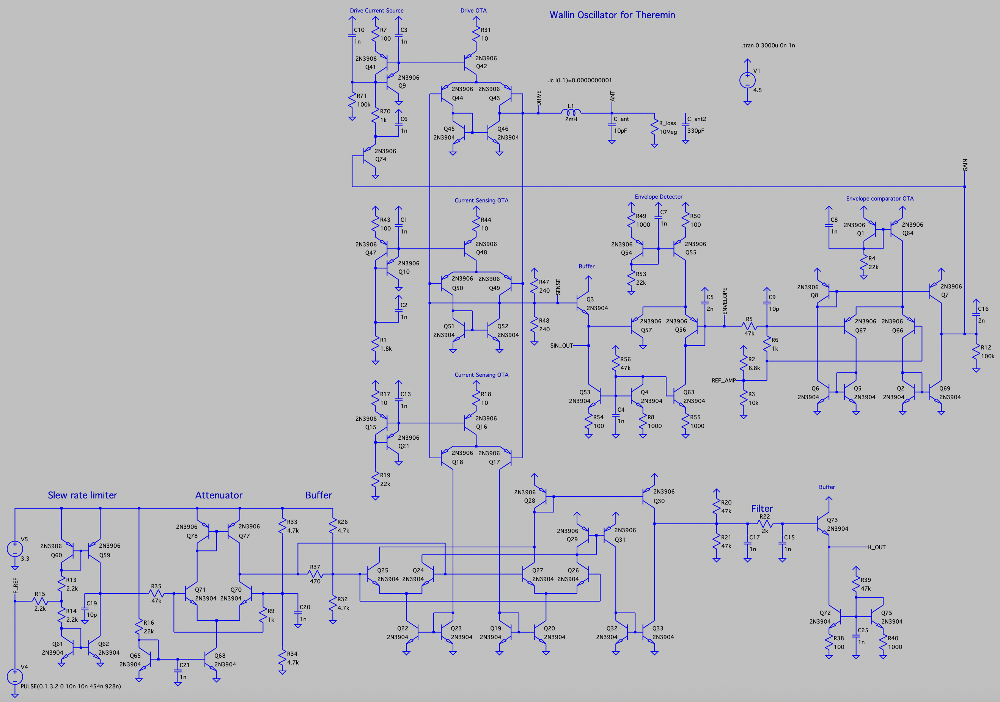
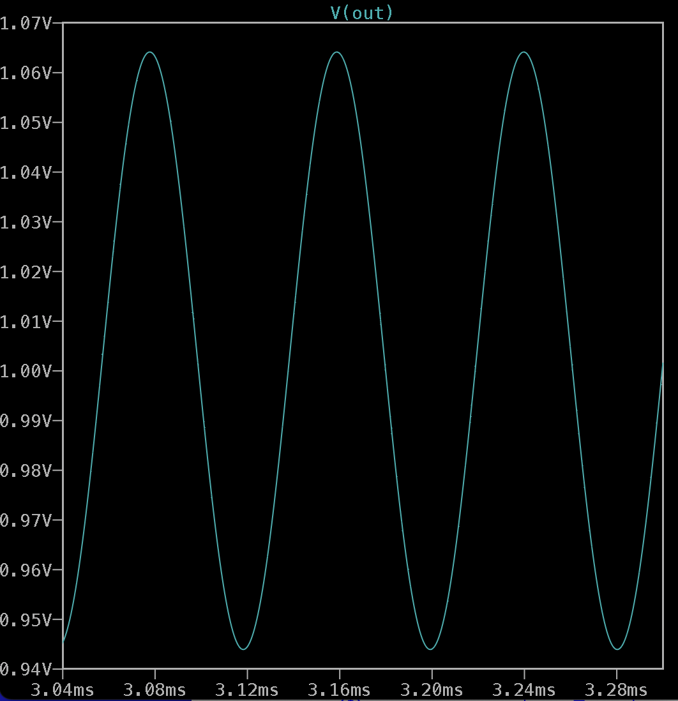
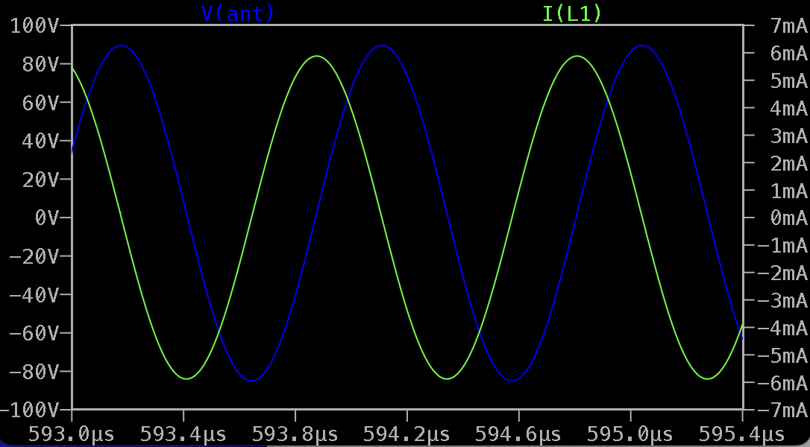
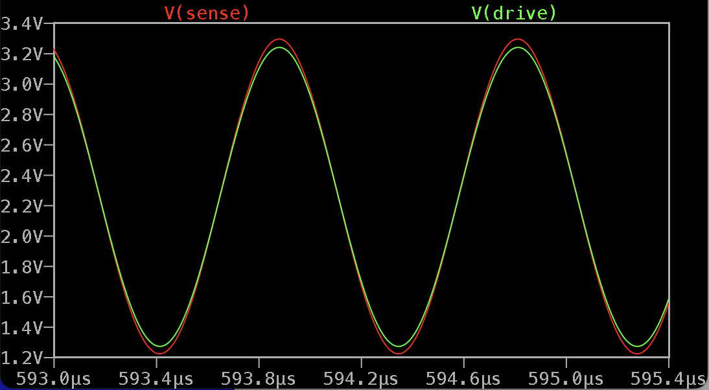

Current Sensing Theremin Oscillator With Heterodyne
===================================================

- Current sensing (Wallin) oscillator - produces drive signal in phase with inductor current.
- Clean sine wave drive signal (-50dB harmonics).
- Automatic gain control to keep drive signal at configured amplitude.
- May be adjusted for different parameters of inductor.
- For 2mH 120 Ohm inductor, draws about 40mA, giving 6mA 2Vpp for feeding of LC tank.
- 3.3V square input for reference frequency (expected to be a few KHz higher than oscillator frequency).
- Heterodyne produces pure sine wave audio range output.

LTSpice model: [current_sensing_osc_v14.asc](current_sensing_osc_v14.asc)

Simulation, heterodyne output: 

Simulation, inductor current and antenna voltage: 

Simulation, drive and sense signal: 

