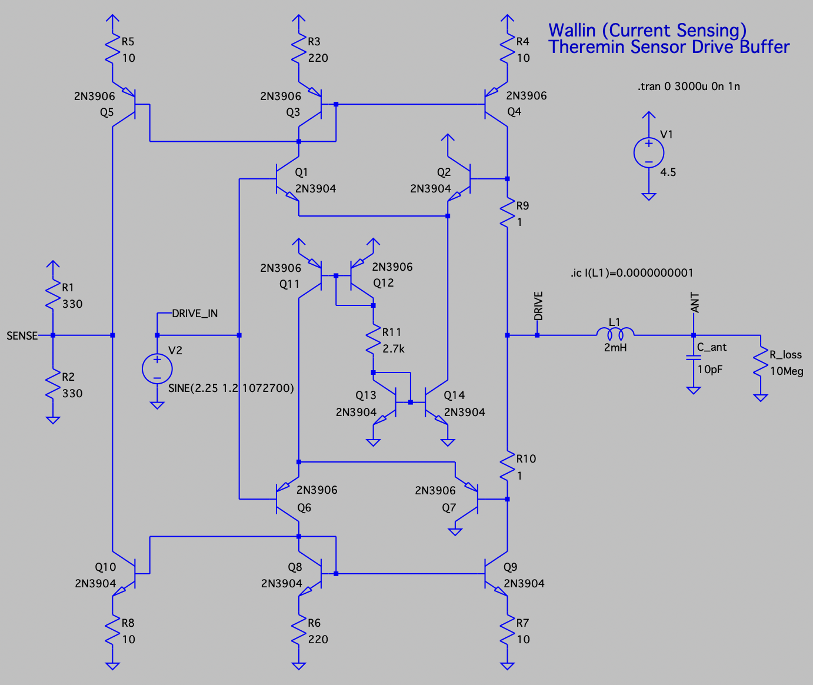
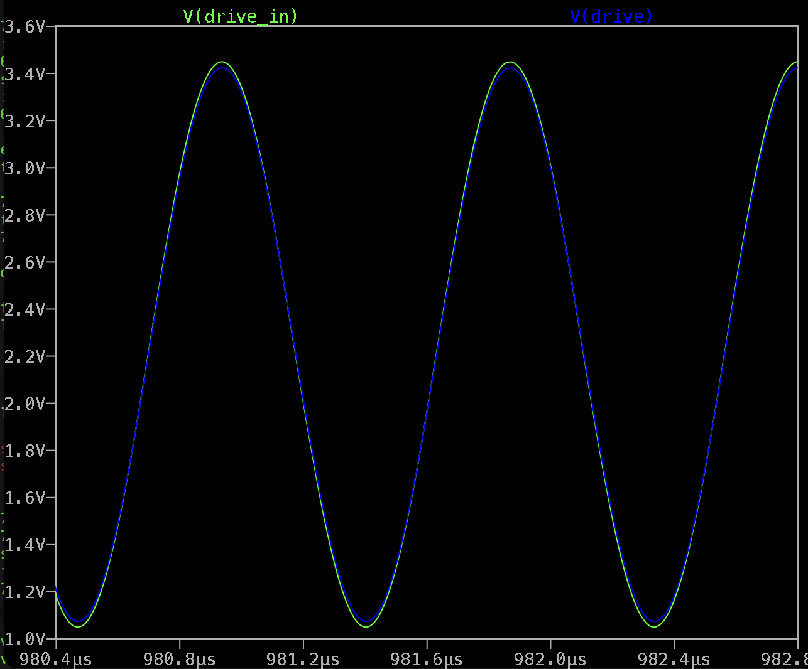
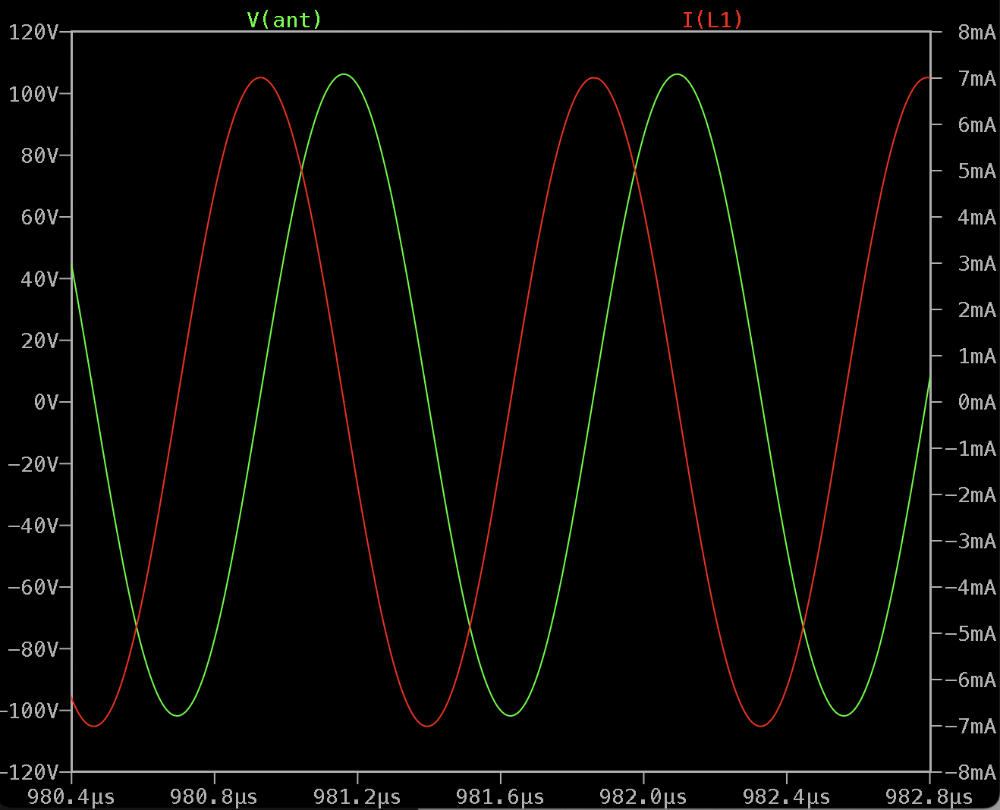
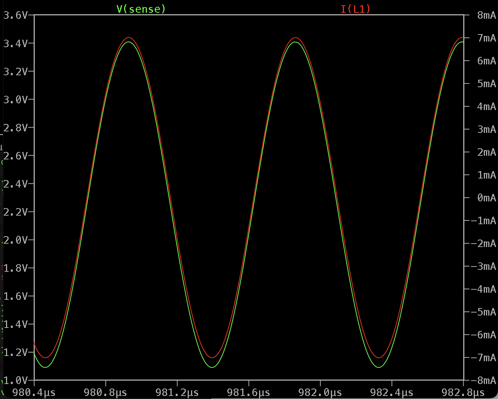

Current Sensing Drive Buffer
============================

- Current sensing (Wallin) oscillator - produces drive signal in phase with inductor current.
- Clean sine wave drive and sense signals
- Sub nanosecond delays
- When powered from 4.5V, can drive 2.4Vpp signal (1V offset from rails)
- Pure BJT design

LTSpice model: [current_sensing_drive_buffer_v02.asc](current_sensing_drive_buffer_v02.asc)

Output push/pull cascade is based on two current mirrors - one (Q3, Q4) sourcing from power rail and second (Q8, Q9) - sinking to ground rail.

Two differencial amplifiers (Q1/Q2 and Q6/Q7) feed current mirrors trying to keep output voltage equal to input.

The low delay copy of output current may be created by extension of current mirrors (Q5,Q10). 

To convert current output to voltage, resistive load may be used (R1/R2). The value of load sets current to voltage conversion ratio.

This buffer may be turned into oscillator by connecting of SENSE to DRIVE_IN. But it requires some automatic gain control to keep drive signal amplitude at desired level.

Simulation, drive input and output: 

Simulation, inductor current and antenna voltage: 

Simulation, inductor currnet and sense signal: 

