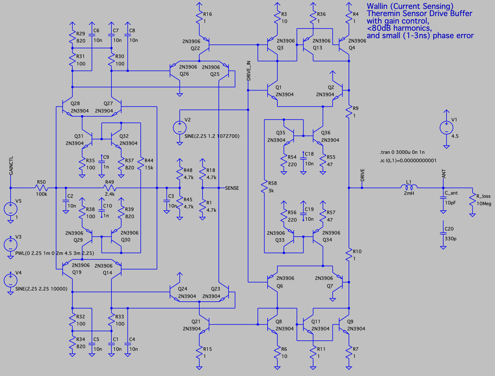

Current Sensing Drive Buffer with Gain Control
==============================================

- Current sensing (Wallin) oscillator - produces drive signal in phase with inductor current.
- Clean sine wave drive and sense signals
- Sub nanosecond delays
- When powered from 4.5V, can drive 2.4Vpp signal (1V offset from rails)
- Pure BJT design
- Voltage controlled gain of current to voltage transform

LTSpice model: [current_sensing_drive_buffer_v06.asc](current_sensing_drive_buffer_v06.asc)

Gain control voltage is converted to differential control voltage for differencial amplifiers which multiply sense current by value < 1

Simulation, drive input, gain control and sense: 

