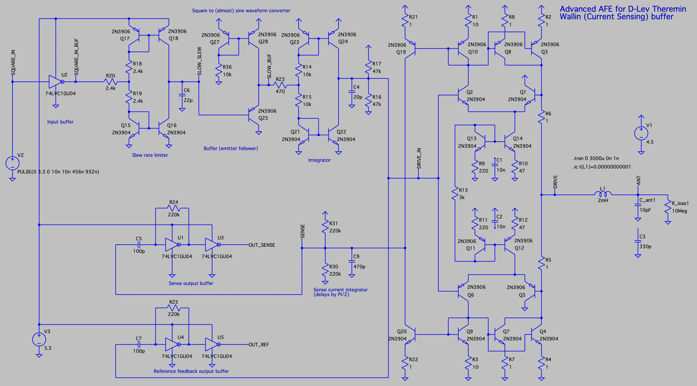
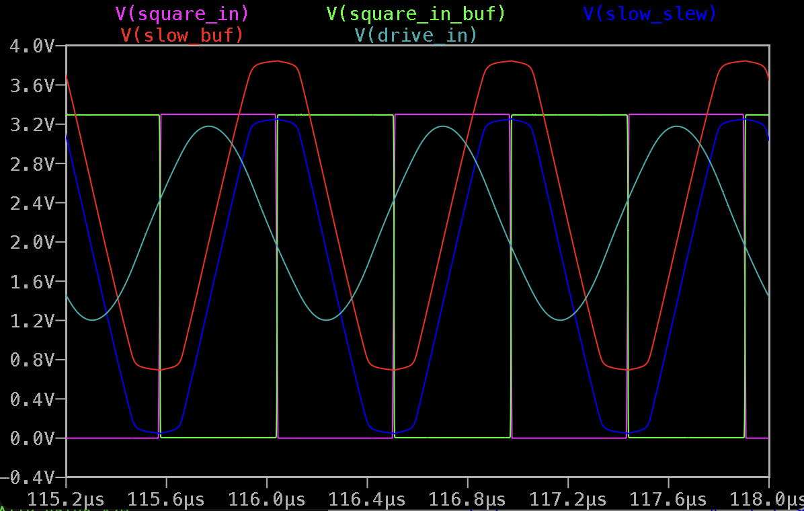
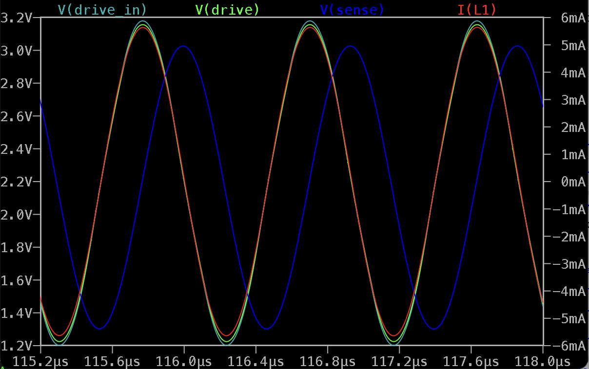
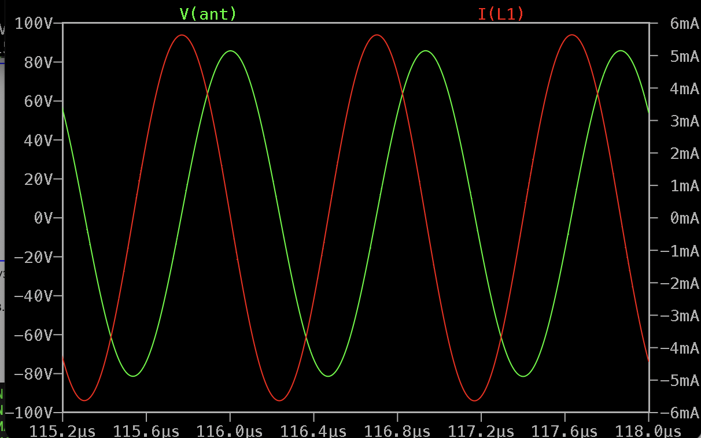
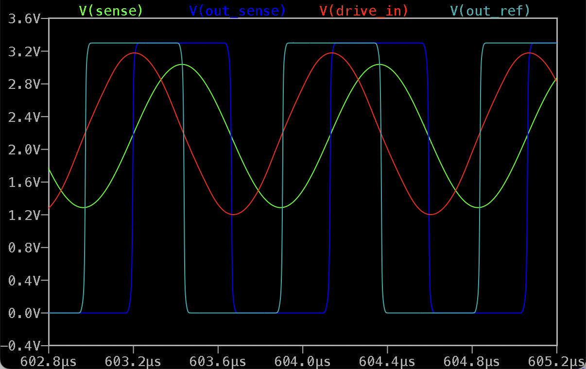

D-Lev Theremin AFE Replacement with Current Sensing
===================================================

- Current sensing (Wallin) drive buffer with precise current output
- Sense current is being integrated to provide classic D-Lev compatible PI/2 phase shift
- Clean sine wave drive and sense signals
- Pure BJT design, with a few unbuffered inverters for interfacing with digital part

LTSpice model: [dlev_afe_bjt_current_sense_v01.asc](dlev_afe_bjt_current_sense_v01.asc)

Input signal converted from square to almost sine (<40dB harmonics)

Drive amplifier provides copy of 1/2 LC tank drive current as output (clean sine wave)

Sense current is being integrated to get PI/2 phase shift for classic D-Lev AFE compatibility.

Drive and sense sines are being converted to square using self-biasing unbuffered inverters.

When LC tank is driven by frequency equal to LC tank resonant frequency, OUT_SENSE signal is PI/2 delayed OUT_REF

Simulation, input signal conditioning: 

Simulation, drive and sense signals: 

Simulation, inductor current and antenna voltage: 

Simulation, output signals: 
