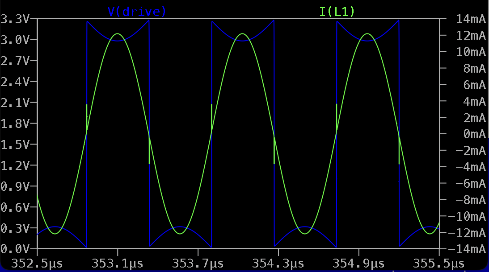
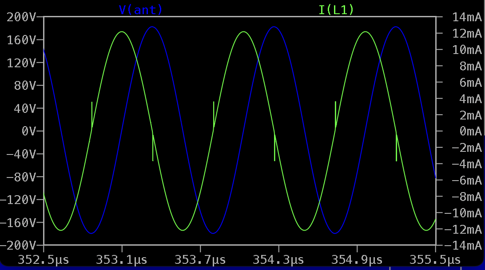
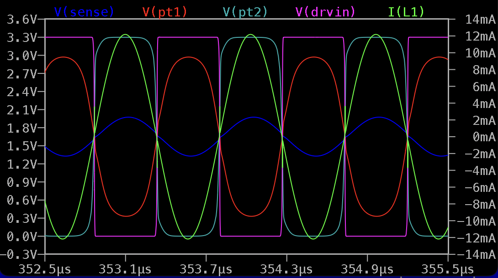

Current Sensing LC Oscillator for Digital Theremin
==================================================

- Current sensing (Wallin) oscillator on 4-BJT dual current mirrors current sensor and unbuffered invertors
- Square 3.3V 50% duty cycle output for measuring of the frequency
- Antenna viltage swing 300 - 1000 Vpp depending on inductor parameters when powered from 3.3V

LTSpice model: [curr_sens_osc_v01.asc](curr_sens_osc_v01.asc)

* LC tank is fed by single unbuffered inverter
* Drive inverter has sensing resistors on both power supply rails
* Dual current mirror (4 BJTs) senses drive current
* R6, R7, R8 selected to have SENSE signal sine waveform amplitude below the power rails (1/2 or 1/3 of 3.3V)
* Three stages of unbuffered inverters amplify, shaping, and invert sensed signal
* Additional buffer for oscillator output, to avoid influence of long oscillator-to-MCU line

Simulation, drive voltage waveform and inductor current: 

Simulation, inductor current and antenna voltage swing: 

Simulation, current sensing amplification stages: 
