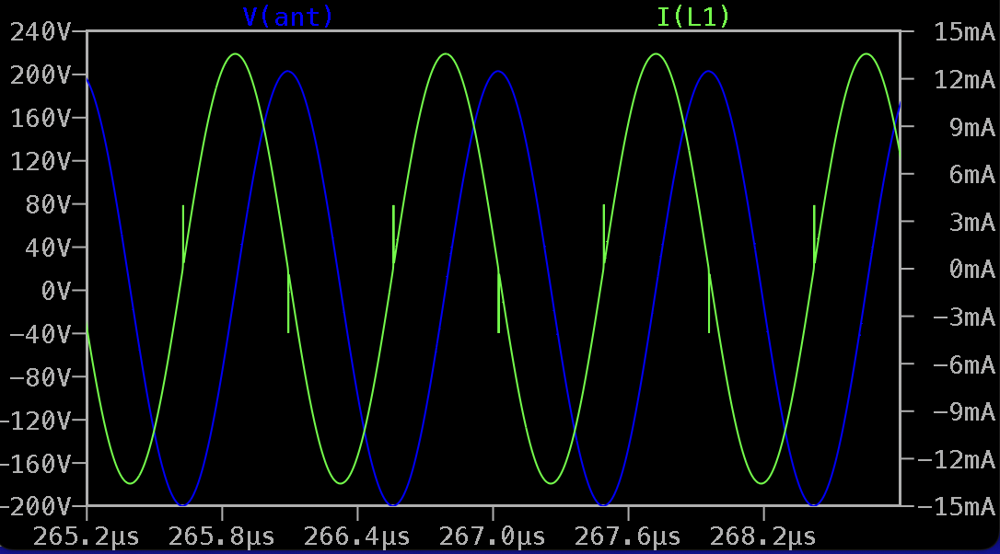

Current Sensing Analog Front End for D-Lev Theremin
===================================================

* 3.3V power supply
* Compatible with D-Lev
* Uses current sensing method (Wallin Osillator)
* 8-BJT current sensor with internal integrator for 90 degrees phase shift
* 7 unbuffered inverters
* Drives LC tank with 13mA square for 2mH 120 Ohm inductor - with 400Vpp on antenna

LTSpice model: [dlev_afe_v01.asc](dlev_afe_v01.asc)

Simulation results
------------------

Drive waveform and inductor current: 

Inductor current and antenna voltage swing: 

Current sensor sine and square outputs (REF, SENSE):

