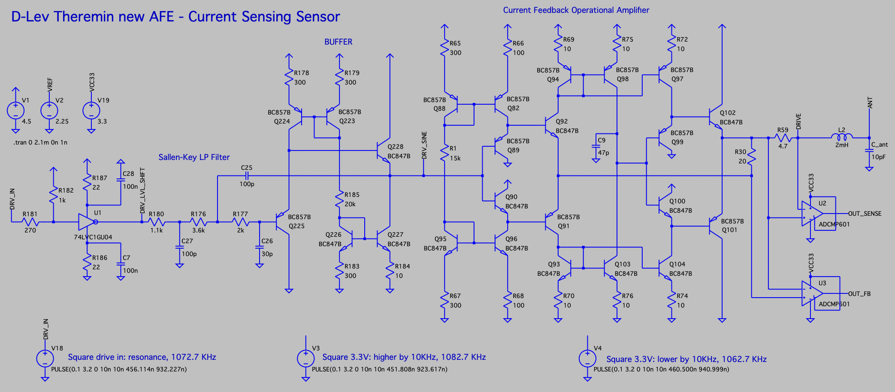
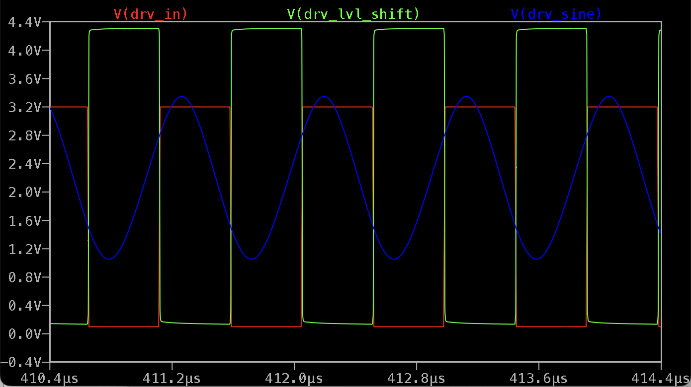
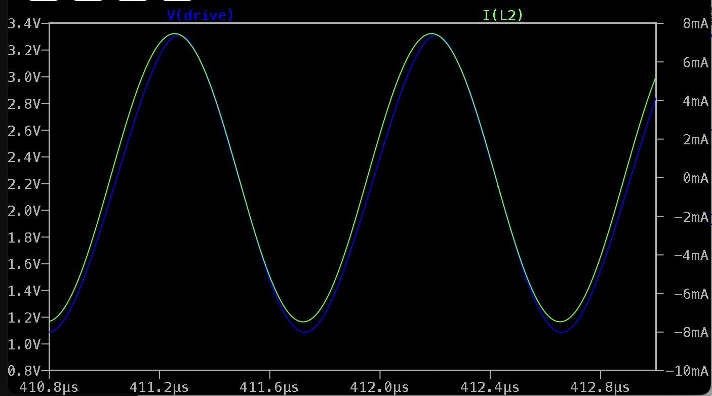
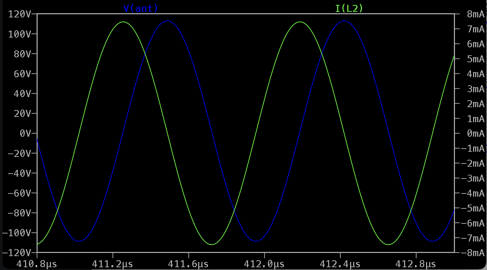
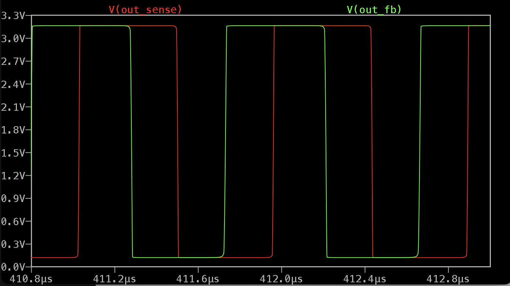
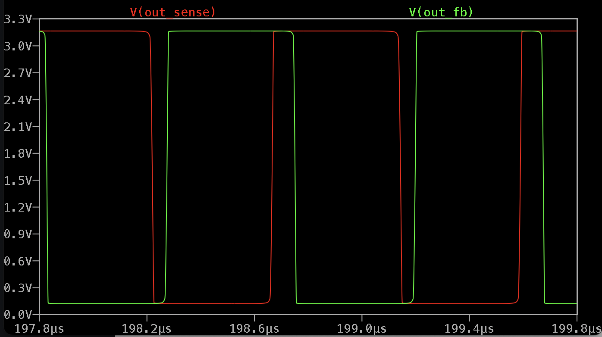
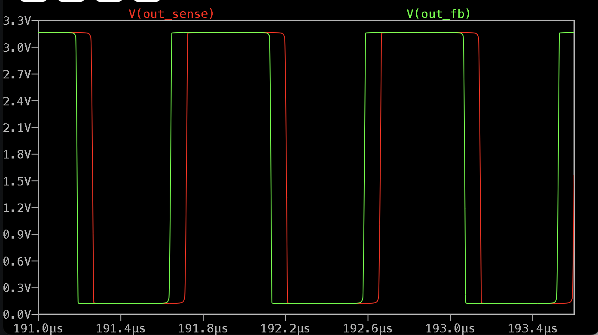
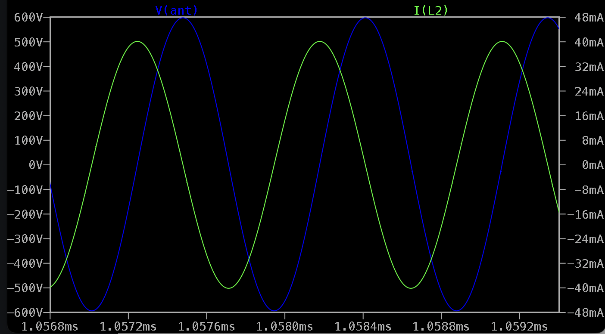

Current sensing D-Lev Theremin Analog Front-End
===============================================

This model is intended to be used as D-Lev AFE drop-in replacement.

Advantages
----------

* Current sensing approach - less noise (sensing point is isolated from antenna by inductor)
* Sine drive waveform probably can reduce noise (3rd sallen-key LP filter used to convert square drive signal to sine wave)
* Can drive high Q inductors
* Although current through LC tank at resonance is in-phase with drive signal, this schematic provides 90 degrees D-Lev compatible phase shift at resonance.

Interface
---------

* Drive input: square 3.3V signal from FPGA
* Feedback output: squared copy of a drive signal passed to antenna, shifted by 90 degrees for D-Lev DPLL compatibility.
* Sense output: squared copy of current sense signal.
* Power supply: +5V, two linear regulators - for 4.5V and 3.3V
* Ground

Schematic
---------

LTSpice model: [dlev_frontend_curr_sens_v01.asc](dlev_frontend_curr_sens_v01.asc)

In the simulation below, 2mH inductor having 120 Ohms serial resistance is used.

With such inductor and 2.4Vpp drive, draws about 15mA from power supply.

Converting 3.3V square drive signal to ~24Vpp sine centered near 2.25V:

Drive voltage and current (at resonance)

Inductor current and antenna voltage	

Outputs when frequency is close to resonance

Outputs when frequency is 10KHz higher than resonance

Outputs when frequency is 10KHz lower than resonance

Extreme mode: inductor current and antenna voltage with high Q inductor (20 Ohm serial resistance; R_sense reduced to 2 Ohms)\

Expected to see 1200 Vpp on antenna and 40mA drive strength. Draws about 30mA from power supply in this mode.

