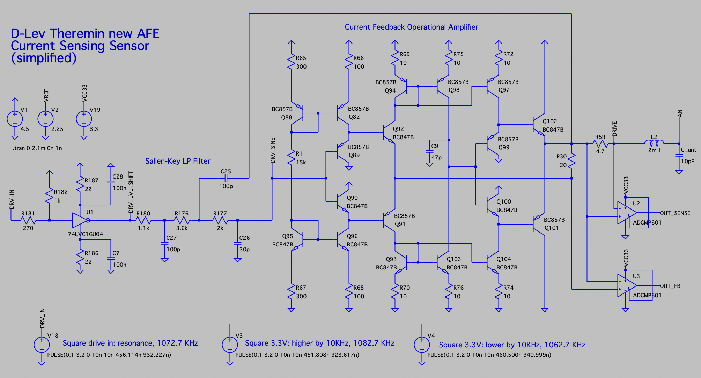
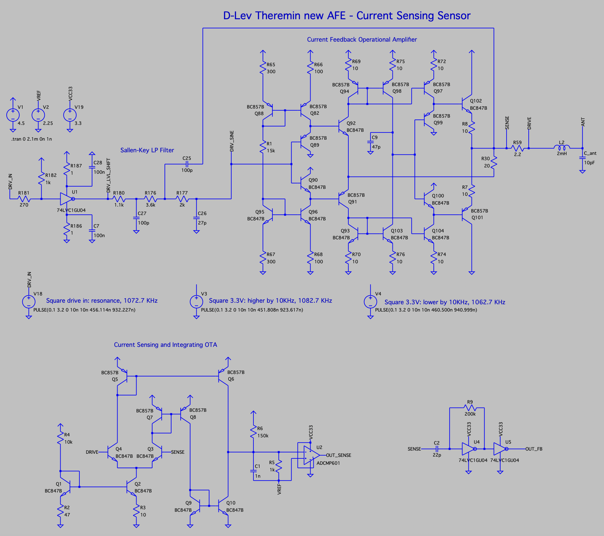
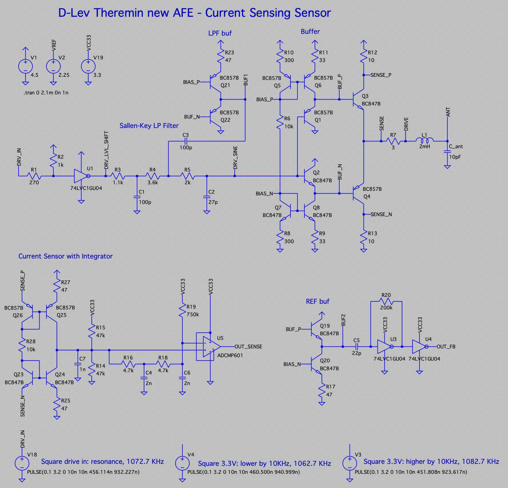
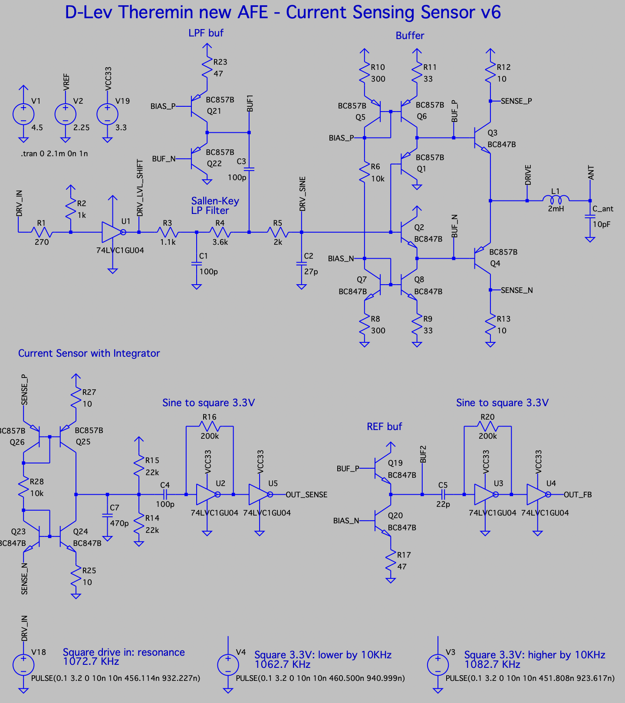
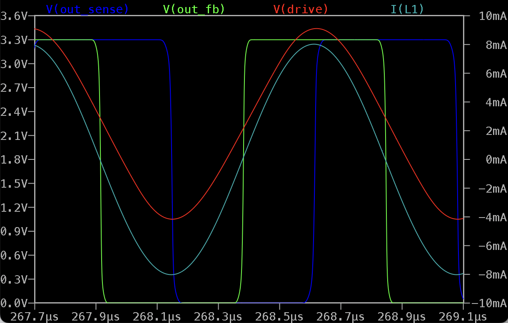
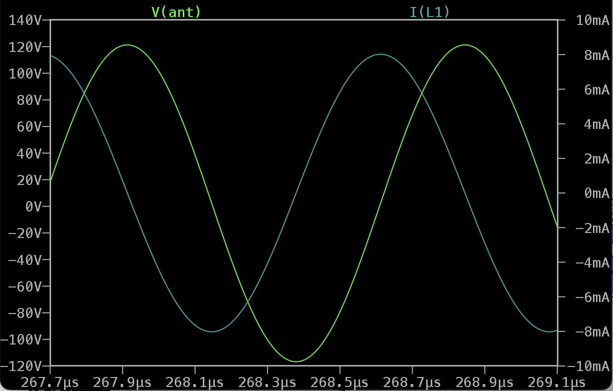
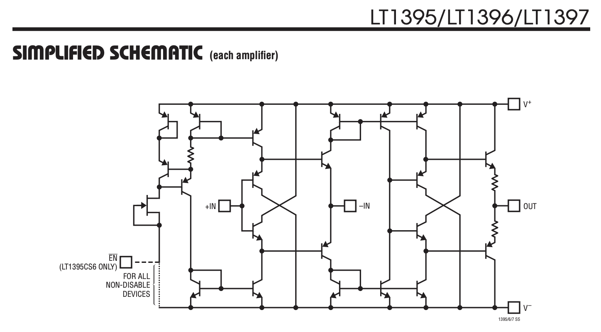
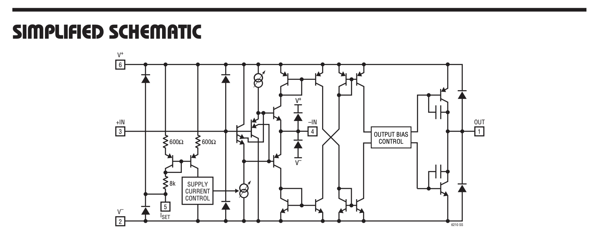

Current sensing D-Lev Theremin Analog Front-End
===============================================

This model is intended to be used as D-Lev AFE drop-in replacement.

Advantages
----------

* Current sensing approach - less noise (sensing point is isolated from antenna by inductor)
* Sine drive waveform probably can reduce noise (3rd sallen-key LP filter used to convert square drive signal to sine wave)
* Can drive high Q inductors
* Although current through LC tank at resonance is in-phase with drive signal, this schematic provides 90 degrees D-Lev compatible phase shift at resonance.

Interface
---------

* Drive input: square 3.3V signal from FPGA
* Feedback output: squared copy of a drive signal passed to antenna, shifted by 90 degrees for D-Lev DPLL compatibility.
* Sense output: squared copy of current sense signal.
* Power supply: +5V, two linear regulators - for 4.5V and 3.3V
* Ground

V1 Schematic
------------

LTSpice model: [dlev_frontend_curr_sens_v01.asc](dlev_frontend_curr_sens_v01.asc)

In the simulation below, 2mH inductor having 120 Ohms serial resistance is used.

With such inductor and 2.4Vpp drive, draws about 15mA from power supply.

Simplified schematic - LP filter can reuse output buffer.
-----------------------------------------------------------------------------------------------

LTSpice model: [dlev_frontend_curr_sens_v02.asc](dlev_frontend_curr_sens_v02.asc)

V4: Schematic with integrating OTA current sensor, single comparator.
-----------------------------------------------------------------------------------------------

LTSpice model: [dlev_frontend_curr_sens_v04.asc](dlev_frontend_curr_sens_v04.asc)

V5: Simplified buffer, separate buffers for LP filter and REF output, simplified current sensor.
-----------------------------------------------------------------------------------------------

LTSpice model: [dlev_frontend_curr_sens_v05.asc](dlev_frontend_curr_sens_v05.asc)

V6: Get rid of comparator in current sensor. Only cheap components used.
-----------------------------------------------------------------------

Let's remove comparator, and use the same sine to square converter using unbuffered inverters, like for ref.

Sensing current and voltage had to be increased to provide bigger voltage swing for inverter input.

LTSpice model: [dlev_frontend_curr_sens_v06.asc](dlev_frontend_curr_sens_v06.asc)

Simulation results near resonance: drive voltage, inductor current, sense and ref outputs:

Simulation results near resonance: inductor current and antenna voltage:

Some simulation results (v1)
----------------------------

Converting 3.3V square drive signal to ~24Vpp sine centered near 2.25V:

Drive voltage and current (at resonance)

Inductor current and antenna voltage	

Outputs when frequency is close to resonance

Outputs when frequency is 10KHz higher than resonance

Outputs when frequency is 10KHz lower than resonance

Extreme mode: inductor current and antenna voltage with high Q inductor (20 Ohm serial resistance; R_sense reduced to 2 Ohms)\

Expected to see 1200 Vpp on antenna and 40mA drive strength. Draws about 30mA from power supply in this mode.

Components
----------

It's possible to get rid of BJTs, by adding IC for current feedback opamp, and buffer opamp IC.
Alternative solution is to get rid of separate LP filter buffer IC, and reuse drive buffer output.

Only 4.5V or less supply voltage opamps are suitable unless it's possible to provide to AFE supply higher than 5V.

Current feedback opamp on discrete BJTs may be replaced with IC. Possible candidates (filtering by min supply voltage and availability):

* LT6210 - can work from 3V, up to 80mA drive current, EUR3.91 on Mouser, not in stock on JLCPCB (estimated price $2.16)
* LT6211 - dual, can work from 3V, up to 75mA drive current, EUR 3.99 on Mouser, not in stock on JLCPCB
* LMH6723 - can work from 4.5V EUR2.5 on Mouser, not in stock on JLCPCB
* LT1395 - min supply voltage 4V, up to 80mA drive current, Mouser price $3.38, not in stock on JLCPCB (estimated price $1.7)
* AD8014 - min supply 4.5V, drives 40-50mA load, EUR 4.54 on Mouser, in stock $2.99 on JLCPCB
* AD8000 - min supply 4.5V, drives 100mA, $5.7 on JLCPCB
* OPA2675 - dual, min supply 4.5V, can drive 1000mA!!! mouser price EUR3.28, in stock on JLCPCB $4.47

LTSpice has LT1395 and LT6210 out of the box.

Schematic from LT1395 current feedback opamp datasheet (close to proposed schematic):

Schematic from LT6210 current feedback opamp datasheet (common emitter output stage allows almost rail-to-rail output):

 

Simulation with LT1395 and LT6210 instead of discrete opamp shows that a trick with 
getting drive signal shifted by 90 degrees from negative input current will not work because these ICs are tuned to have minumum feedback current during operation.
Small current (10-40uA) is too hard to sense. So, to use normal opamp with small feedback current instead of discrete one (which is tuned to have high feedback current), 
different solution for 90 degrees shift should be found.

As well, both ICs are instable if negative input is connected directly to output (generate at high frequency due to positive feedback).

To avoid generation, at least resistor from output to negative input is required. But better solution is to have an additional resistive load from output to the ground.

If there is anyway a resistor from output to ground for stability, it makes sense to feed negative input through 
resistive to get a gain for achieving higher drive voltage swing (4.5-2*0.3V for LT6210 or 4.5-2*0.7V for LT1395).

Need to check how will LP filter behave if non-unity implemented with non-unity buffer.

Ideas for getting of 90 degrees shift at resonance.

* get drive feedback without shift; advantages: we can get rid of feedback comparator, and use something like self-biasing unbuffered inverter buffer instead.
* current sensing cirquit has to be reworked to provide additional 90 degrees shift (e.g. via additional integrator); possible advantage - integrated signal is naturally LP filtered and has less noise.

Comparators

* ADCMP600 - $2.05 on JLCPCB, big stock
* TBD: something cheaper?

