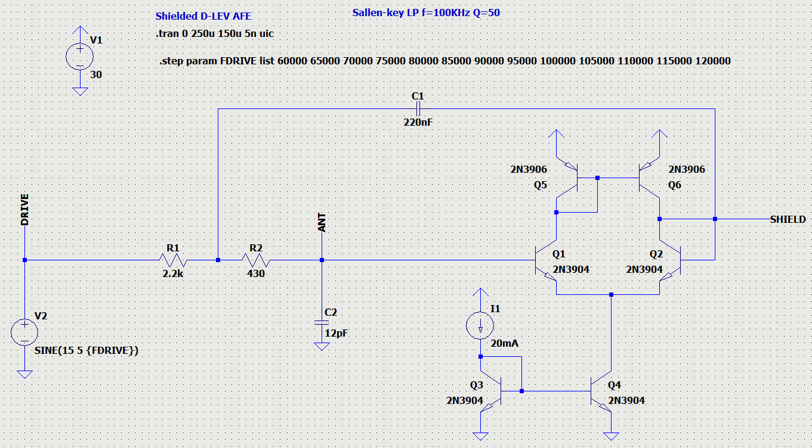
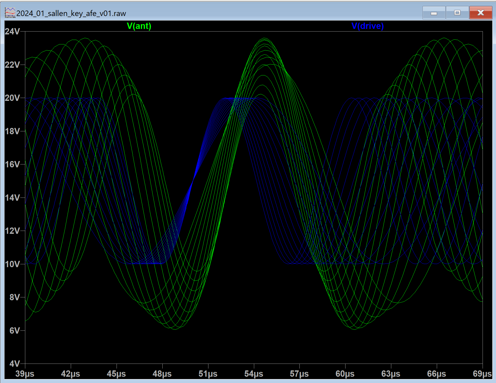

Sallen-key filter based shielded AFE
====================================

Simulation of shielded sallen-key LP filter based sensor [proposed by Eric Wallin](https://www.youtube.com/watch?v=ojJ5O-i3c0w), with BJT-based OTA as an amplifier.

LTSpice model: [2024_01_sallen_key_afe_v01.asc](2024_01_sallen_key_afe_v01.asc)

Simulation results: drive signal and voltage on antenna

Using of better current mirror improves Q from 13 to 17.

Improved LTSpice models: [2024_01_sallen_key_afe_v04.asc](2024_01_sallen_key_afe_v04.asc)

