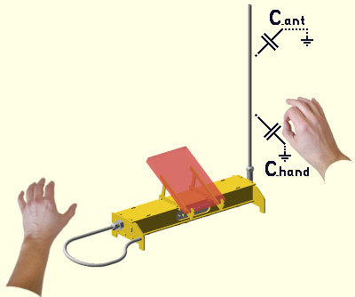

Theremin sensors theory
=======================

In theremins, sound is being controlled by distance of hands from two "antennas" (rods or plates of metal).

Antenna is a common naming, but actually, Theremin antenna is working as an electrode of the capacitor. 

* Pitch antenna controls sound frequency (note).
* Volume antenna controls gain.

Theremin should sense hand to antenna distances, and synthesize output signal of proper pitch and volume.

How can Theremin feel the distance? Distance of hand to antenna changes antenna capacitance.

Capacitance of antenna seen by theremin can be divided into fixed and variable parts.

* C_ant is antenna self capacitance and capacitance from antenna to environment which is considered as non changing

* C_hand is capacitance varying mostly depending on distance from hand to antenna

Typical C_ant value is about 8-10pF, depends on antenna geometry and placement of nearby objects.

Typically, C_hand part of capacitance is about 2pF when hand is close to antenna, and drops by 3.5 .. 4 times for each additional 10cm distance.

Table below shows how antenn capacitance introduced by hand position depends on distance from hand to antenna.

|=====|=====|=====|
|3.5/10cm decay|4/10cm decay|
|L, cm|C_hand, pF|C_hand, pF|
|=====|=====|=====|
|0|2.000000000|2.000000000|
|1|1.764506210|1.741101127|
|2|1.556741083|1.515716567|
|3|1.373439654|1.319507911|
|4|1.211721400|1.148698355|
|5|1.069044968|1.000000000|
|6|0.943168242|0.870550563|
|7|0.832113110|0.757858283|
|8|0.734134375|0.659753955|
|9|0.647692332|0.574349177|
|10|0.571428571|0.500000000|
|11|0.504144632|0.435275282|
|12|0.444783167|0.378929142|
|13|0.392411330|0.329876978|
|14|0.346206114|0.287174589|
|15|0.305441419|0.250000000|
|16|0.269476641|0.217637641|
|17|0.237746603|0.189464571|
|18|0.209752679|0.164938489|
|19|0.185054952|0.143587294|
|20|0.163265306|0.125000000|
|21|0.144041323|0.108818820|
|22|0.127080905|0.094732285|
|23|0.112117523|0.082469244|
|24|0.098916033|0.071793647|
|25|0.087268977|0.062500000|
|26|0.076993326|0.054409410|
|27|0.067927601|0.047366143|
|28|0.059929337|0.041234622|
|29|0.052872843|0.035896824|
|30|0.046647230|0.031250000|
|31|0.041154664|0.027204705|
|32|0.036308830|0.023683071|
|33|0.032033578|0.020617311|
|34|0.028261724|0.017948412|
|35|0.024933993|0.015625000|
|36|0.021998093|0.013602353|
|37|0.019407886|0.011841536|
|38|0.017122668|0.010308656|
|39|0.015106527|0.008974206|
|40|0.013327780|0.007812500|
|41|0.011758475|0.006801176|
|42|0.010373951|0.005920768|
|43|0.009152451|0.005154328|
|44|0.008074778|0.004487103|
|45|0.007123998|0.003906250|
|46|0.006285169|0.003400588|
|47|0.005545110|0.002960384|
|48|0.004892191|0.002577164|
|49|0.004316150|0.002243551|
|50|0.003807937|0.001953125|
|51|0.003359564|0.001700294|
|52|0.002963986|0.001480192|
|53|0.002614986|0.001288582|
|54|0.002307079|0.001121776|
|55|0.002035428|0.000976562|
|56|0.001795763|0.000850147|
|57|0.001584317|0.000740096|
|58|0.001397769|0.000644291|
|59|0.001233186|0.000560888|
|60|0.001087982|0.000488281|
|61|0.000959876|0.000425074|
|62|0.000846853|0.000370048|
|63|0.000747139|0.000322145|
|64|0.000659166|0.000280444|
|65|0.000581551|0.000244141|
|66|0.000513075|0.000212537|
|67|0.000452662|0.000185024|
|68|0.000399363|0.000161073|
|69|0.000352339|0.000140222|
|70|0.000310852|0.000122070|
|71|0.000274250|0.000106268|
|72|0.000241958|0.000092512|
|73|0.000213468|0.000080536|
|74|0.000188333|0.000070111|
|75|0.000166157|0.000061035|
|76|0.000146593|0.000053134|
|77|0.000129332|0.000046256|
|78|0.000114104|0.000040268|
|79|0.000100668|0.000035055|
|80|0.000088815|0.000030518|
