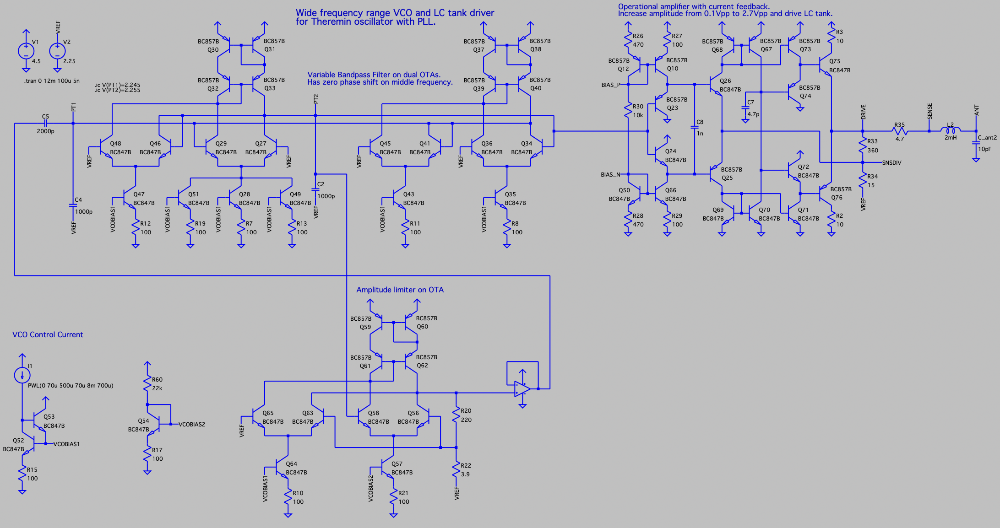
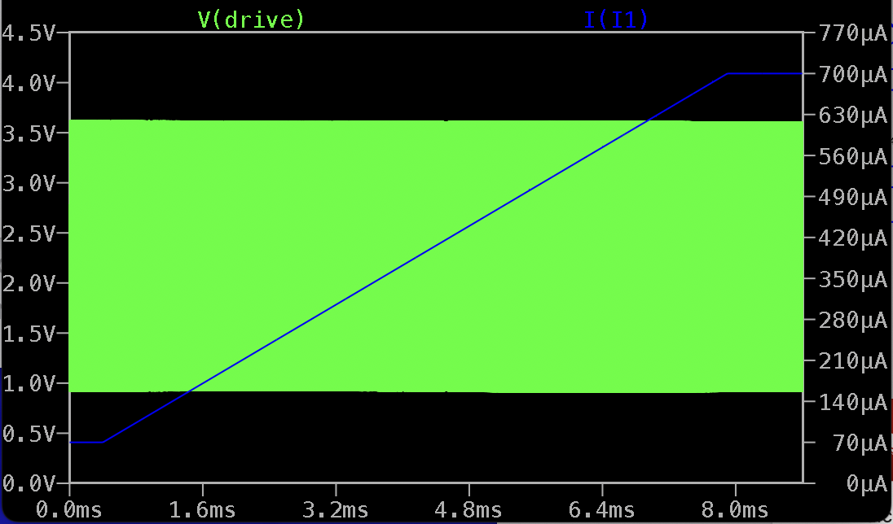
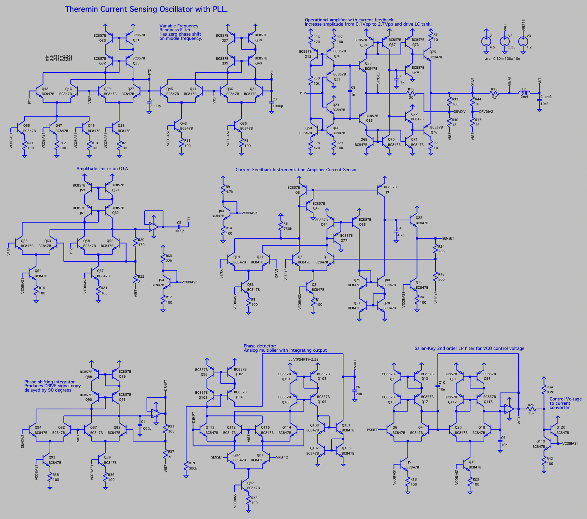
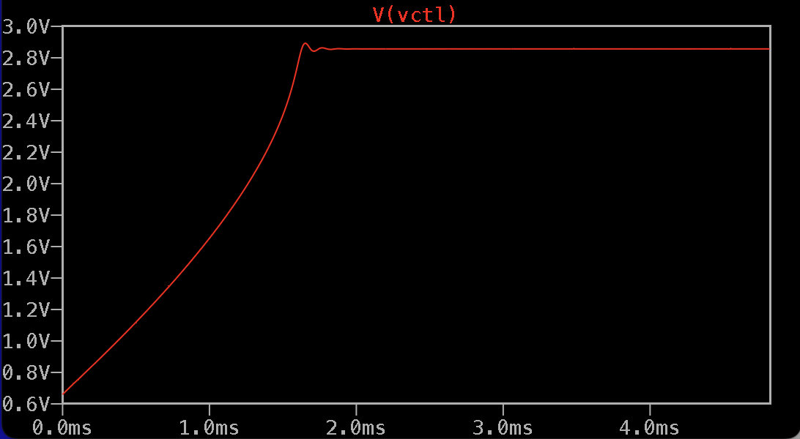
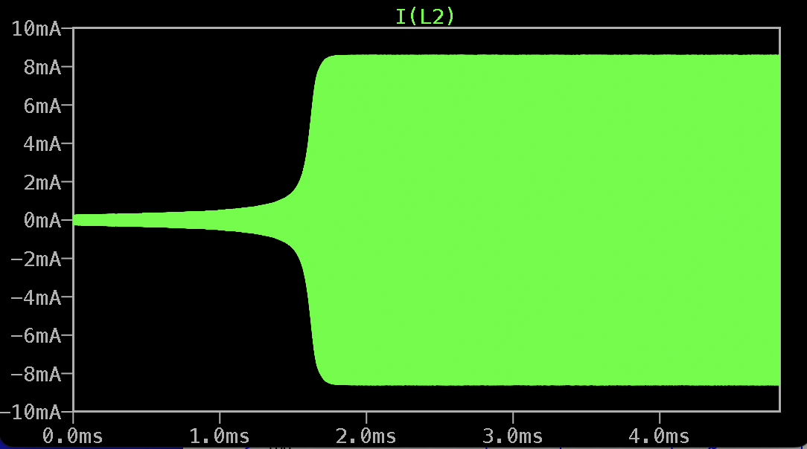
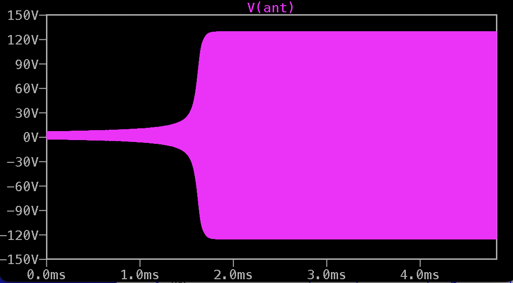
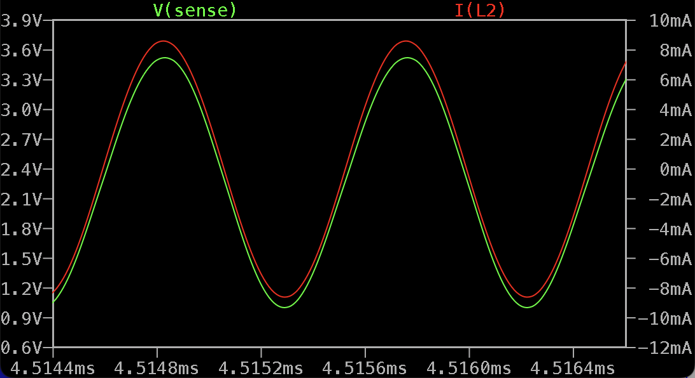
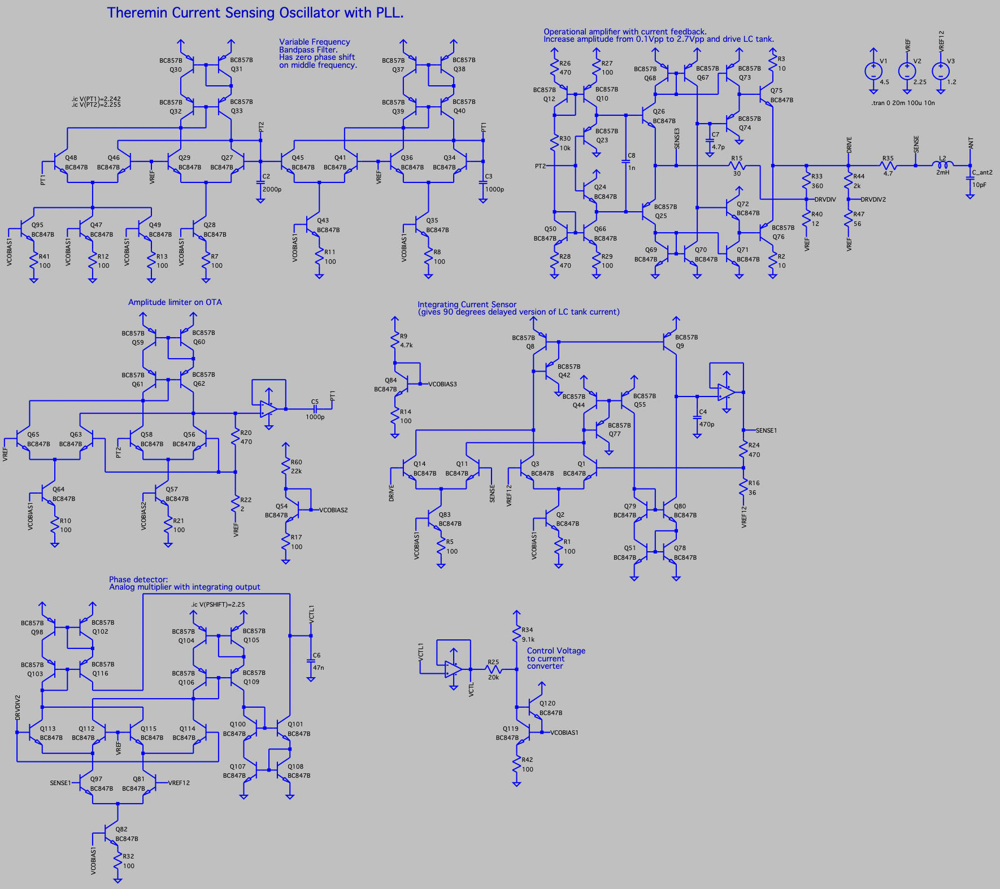
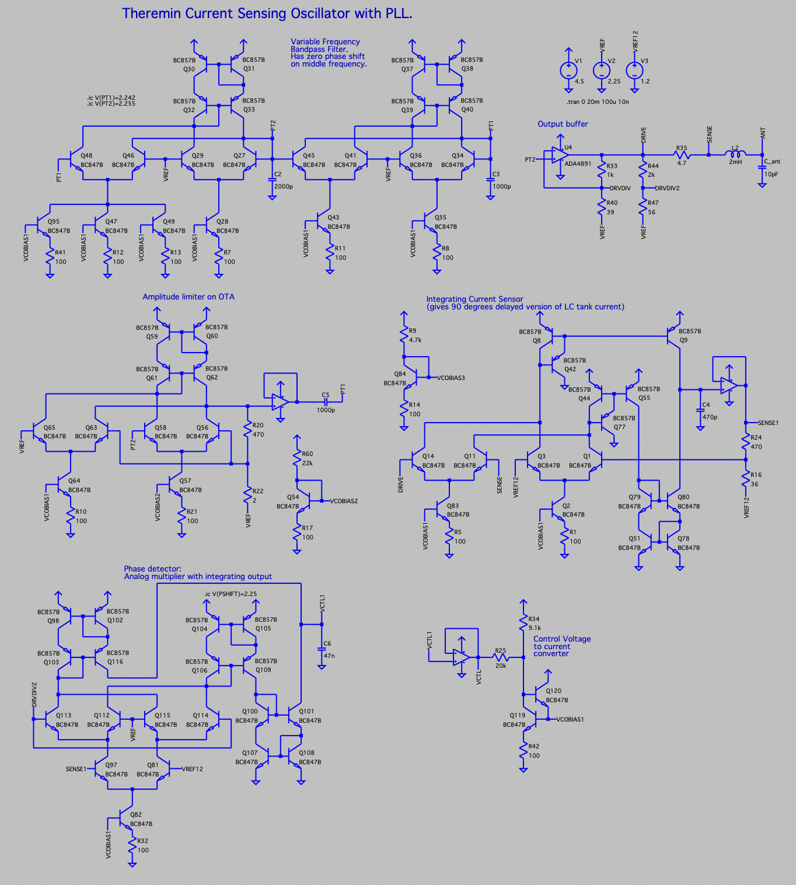

Wide frequency range Sine Outout VCO built mostly on BJTs with LC Tank Drive Buffer
===================================================================================

- Stable amplitude for wide range of output frequencies (100KHz .. 2MHz)

- Pure sine waveform output (40dB harmonics)

- 4.5V power supply

LTSpice model: [vco_and_lc_drive_v01.asc](vco_and_lc_drive_v01.asc)

Simulation, VCO output for frequency sweeping in full range: 

Current sensing LC oscillator with PLL on BJTs for Theremins v2
===============================================================

* VCO and drive buffer - from previous step
* Current sensing via sensing resistor and current feedback opamp (made of BJT)
* Using integrator to shift drive signal by 90 degrees
* Using analog multiplier as phase detector

LTSpice model: [vco_and_lc_drive_v02.asc](vco_and_lc_drive_v02.asc)

Simulation results
------------------

PLL control voltage

LC tank current

Antenna voltage

LC tank drive voltage and current in locked state

Current sensing LC oscillator with PLL on BJTs for Theremins v3
===============================================================

Simplified version.

* Phase delay integrator moved from drive voltage signal to current sensing
* CV lowpass filter is removed

LTSpice model: [vco_and_lc_drive_v03.asc](vco_and_lc_drive_v03.asc)

Current sensing LC oscillator with PLL on BJTs for Theremins v4
===============================================================

Simplified version.

* Opamp as output buffer

LTSpice model: [vco_and_lc_drive_v04.asc](vco_and_lc_drive_v04.asc)

