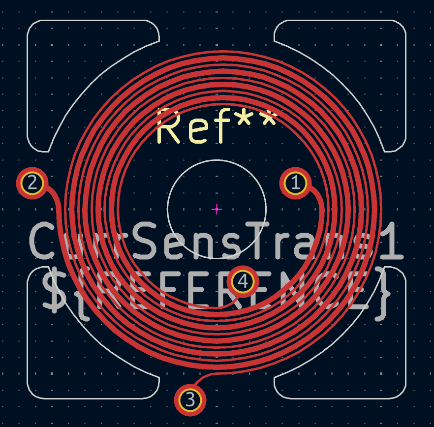

Planar PCB spiral transformer footprint generator for KiCAD.
============================================================

This is a simple footprint generator of planar transformer, compatible with KiCAD.

Both coils of the transformer are placed on the same board side, to allow using it on dual layer PCB.

This is a current sensing transformer, to be used in Theremin Current Sensing Oscillator.

First coil (pins 1, 2) is made of wider trace, to allow currents up to 100mA, is intended to drive Theremin LC tank.

Secondary coil - is sensing one (pins 3, 4) is thinner, is supposed to work at currents below 1mA.

Compatible KiCAD schematics symbols
-----------------------------------

* Transformer/TRANSF1

Default values for main coil
----------------------------

* 4.5 turns
* 0.15 mm trace width
* 12 mm inner diameter of coil
* 0.4 mm step
* L = 0.5uH
* Q = 4

Default values for sensing coil
-------------------------------

* 5 turns
* 0.08 mm trace width
* 12 mm inner diameter of coil
* 0.4 mm step
* L = 0.62uH
* Q = 2

Tuning of the parameters
------------------------

This is simple and dirty java application written in a few hours.

If you want to change the parameters, modify its source file - default values for Options class in the beginning of the file.

